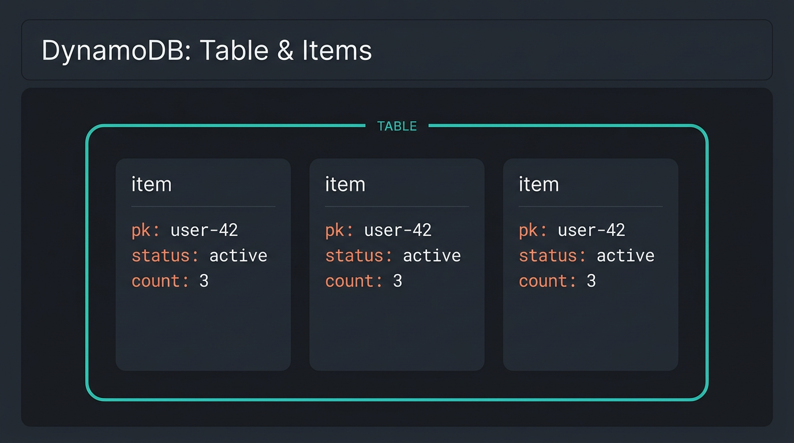
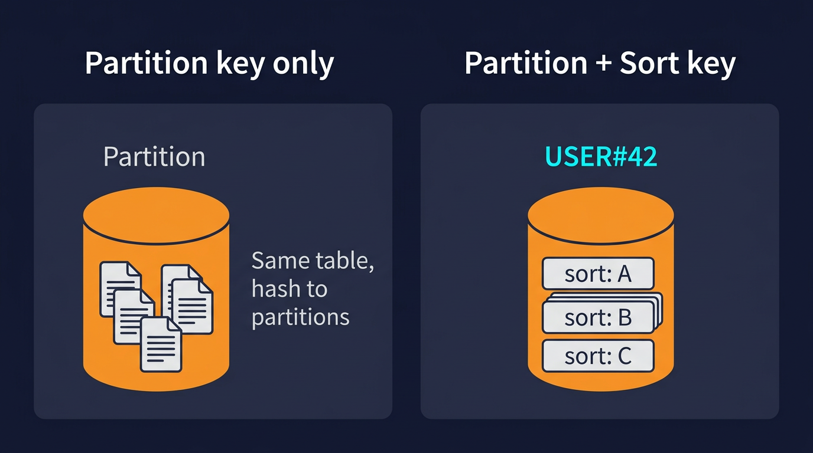

# Amazon DynamoDB (Python / boto3)

A reference for using **DynamoDB** from Python—especially inside **AWS Lambda**, where **boto3** is already available. No prior DynamoDB experience required.

**Prerequisites:** Python dicts and JSON; **`lambda.md`** for Lambda handlers, environment variables, and IAM roles.

---

## What Is DynamoDB?

**Amazon DynamoDB** is a managed **NoSQL** database: you create **tables**, store **items** (records), and query them by **primary key** (and optional secondary indexes). AWS runs scaling and storage; you choose a key design and access patterns.

- **Serverless-friendly:** Pay for storage and read/write capacity (on-demand or provisioned).
- **Fast lookups by key:** Designed for key-value and document-style access, not ad-hoc SQL joins across many tables.

---

## Core Concepts

### Table

A **table** holds a collection of **items**. You define a **primary key** when you create the table (partition key only, or partition + sort key).

### Item

An **item** is a set of **attributes** (name → value), similar to a row, but items in the same table do not need identical attributes (except the key attributes must always be present).



*Figure: A **table** groups many **items**; each item carries its own attributes. Illustrations in this page are conceptual—not official AWS diagrams.*

### Primary key

- **Partition key** (hash key): Required. DynamoDB spreads items across partitions using this value.
- **Sort key** (range key): Optional. With both, the primary key is **composite**; multiple items can share the same partition key if sort keys differ.

Uniqueness: No two items may have the same full primary key.



*Figure: The **partition key** determines how items are distributed. With a **sort key**, the primary key is **composite**: many items can share one partition key value if their sort keys differ. Conceptual illustration for teaching—not an AWS product screenshot.*

### Attribute types (common)

When using **`boto3.resource`** and **`Table.put_item`**, Python types map to DynamoDB types for common cases:

- `str` → String (**S**)
- `int` / `float` → Number (**N**)
- `bool` → Boolean
- `list` / `dict` → List / Map

For low-level **`client`** APIs, numbers are often passed as strings (e.g. `{"N": "42"}`). Prefer the **resource** `Table` API for readability unless you need the client.

---

## Creating a Table (Console)

1. Open **DynamoDB** in the AWS Console.
2. **Create table**.
3. **Table name:** e.g. `MyAppData`.
4. **Partition key:** name and type (**String** or **Number**). Add a **sort key** only if your design needs ordering under one partition.
5. Choose **On-demand** or **Provisioned** capacity per your lab or cost preferences.
6. Create the table and wait until status is **Active**.

Use the **same Region** as your Lambda and other services when possible.

---

## Table name from configuration

Do not hard-code table names in shared source if the name changes per environment. Use **Lambda environment variables** (or Parameter Store):

```python
import os

table_name = os.environ.get("DYNAMODB_TABLE")
if not table_name:
    raise ValueError("DYNAMODB_TABLE is not set")
```

See **`lambda.md`** for setting variables in the Lambda console.

---

## `put_item` with boto3 (resource)

```python
import os
from datetime import datetime, timezone
import boto3

table_name = os.environ["DYNAMODB_TABLE"]
table = boto3.resource("dynamodb").Table(table_name)

table.put_item(
    Item={
        "id": "unique-primary-key-value",  # must match your table’s key schema
        "status": "processed",
        "processedAt": datetime.now(timezone.utc).isoformat(),
        "metadata": {"source": "s3-event-pipeline"},
    }
)
```

- **`put_item`** creates a new item or **replaces** an existing item with the same primary key.
- Attribute names and key structure must match **your** table definition.

---

## `get_item` (read by primary key)

```python
response = table.get_item(Key={"id": "unique-primary-key-value"})
item = response.get("Item")  # None if not found
```

---

## IAM permissions

The caller (e.g. Lambda **execution role**) needs API permissions such as:

- **`dynamodb:PutItem`**, **`dynamodb:GetItem`**, **`dynamodb:UpdateItem`**, **`dynamodb:Query`**, etc., scoped to your table ARN as appropriate.

If you see **AccessDeniedException**, attach or adjust policies on the role. Course labs may provide a role (e.g. **LabRole**) with broad access for learning.

---

## Error handling

Wrap **`put_item`** and other DynamoDB calls in **`try`/`except`** (and any upstream steps such as reading S3, if your flow uses them). Catch **`botocore.exceptions.ClientError`**, log the error code and message, and decide whether to retry, skip, or fail the invocation. See **`lambda.md`** for logging to CloudWatch.

---

## Related material

| File | Use for |
|------|---------|
| **`lambda.md`** | Handler, env vars, boto3 in Lambda, logging |
| **`event-driven-aws.md`** | S3 → SQS → Lambda flow; when notifications drive writes to DynamoDB |

Your **assignment** defines exact table names, key attributes, and required fields.

---

## Checklist

- [ ] Table created in the correct **Region** with the intended **partition key** (and **sort key** if needed).
- [ ] Table name (and region) supplied via **environment variables** or equivalent, not committed secrets.
- [ ] **`put_item`** items include all required key attributes and match types the table expects.
- [ ] Execution role allows **`dynamodb:*`** actions you use on that table.
- [ ] Exceptions from boto3 are caught and logged.
