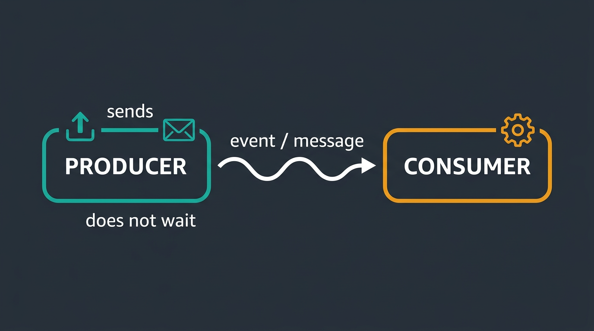
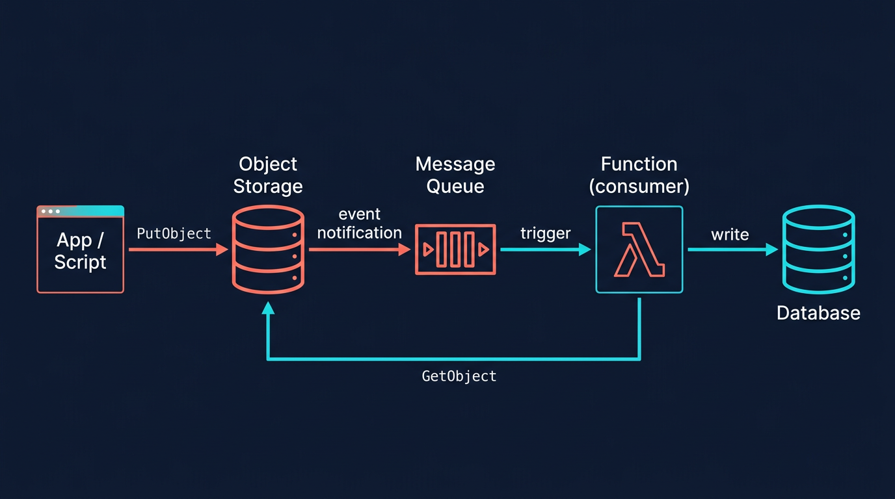
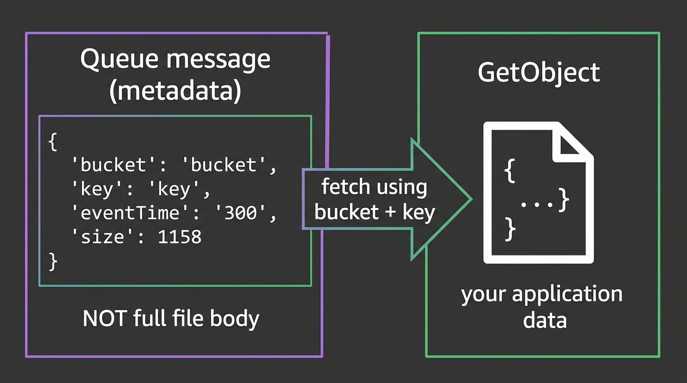

# Event-Driven Programming on AWS

A reference for **event-driven** design on AWS: something happens in one service, **events** or **messages** carry the news, and **consumers** react asynchronously. This doc explains **producers** and **consumers**, then walks through **S3 event notifications to SQS** as a concrete **source of data**, with **Lambda** as a typical consumer.

**Prerequisites:** Python (dicts, JSON, loops, `try`/`except`); **`lambda.md`** for Lambda handlers, environment variables, CloudWatch logging, and execution roles.

---

## What “event-driven” means

In an **event-driven** architecture, components do not call each other in a fixed sequence like a single long function. Instead:

- A **change** occurs (a file lands in storage, a queue receives a message, a schedule fires).
- That change is described in an **event** or **message**.
- **Consumers** run when they receive that information, often independently and at their own pace.

AWS fits this model well: services emit events, **SQS** can buffer work, and **Lambda** can scale out to process many messages.

---

## Producers and consumers

### Producer

A **producer** is anything that **creates** or **sends** data or events for something else to handle.

- It may be **your code** (e.g. a script that uploads a file to S3 or sends a message to a queue).
- It may be **an AWS service** configured to emit notifications (e.g. S3 sending a message to SQS when an object is created).

Producers usually **do not wait** for the consumer to finish; they hand off work and move on.

### Consumer

A **consumer** is anything that **receives** that data or event and **does work** with it: validate, transform, store in a database, call another API, etc.

- Examples: a **Lambda** function triggered by **SQS**, an application **polling** a queue, or a service subscribed to an **EventBridge** bus.

Consumers are responsible for **handling errors** (bad messages, downstream failures) and, with queues, for **deleting or acknowledging** messages only after successful processing when your design requires it.

### Why both matter

Clear **producer** / **consumer** boundaries help you reason about **permissions** (who may send to a queue?), **scaling** (many producers, many Lambda instances), and **retries** (if the consumer fails, the message can become visible again).



*Figure: **Producers** hand off work; **consumers** react when messages arrive. Conceptual illustration for teaching—not an official AWS diagram.*

---

## Example: S3 as a source of data → SQS → Lambda

A common pattern for “something was written to object storage”:

1. **Producer (your application):** Uploads an object to **S3** (e.g. JSON or a data file). This is often a **local or app script** using the AWS SDK (**boto3**).
2. **AWS (S3):** Fires an **event notification** for the configured event type (e.g. object created).
3. **SQS:** Receives a **message** whose body describes the S3 event (bucket, key, size, etc.). S3 here acts as a **managed producer** into the queue.
4. **Consumer (Lambda):** An **SQS trigger** invokes your function with one or more queue messages. Your code parses the message, often **reads the object from S3** (because the message metadata is not the full file body), then does downstream work (e.g. write to **DynamoDB**—see **`dynamodb.md`**).

```text
Your app --PutObject--> S3 --event notification--> SQS --trigger--> Lambda --GetObject--> S3
                                                              '-- downstream (e.g. DynamoDB)
```



*Figure: One common pattern: upload triggers a **queue message**, **Lambda** runs as the **consumer**, often calls **GetObject** again for the real payload, then writes to another store (e.g. DynamoDB). Same ideas apply to other event sources with different shapes.*

This is one **example** of event-driven flow; the same ideas apply to other sources (EventBridge rules, SNS, DynamoDB streams) with different payload shapes.

---

## Amazon SQS (Simple Queue Service)

**SQS** is a managed **message queue**.

- **Producers** send messages (strings, often JSON).
- **Consumers** receive messages, process them, and typically **delete** them after success so they are not processed again.

For learning and many workloads, a **Standard** queue is enough. **FIFO** queues add ordering and deduplication semantics when you need them.

**Console:** Create a queue and note the **ARN** and **URL** for policies and Lambda triggers.

---

## S3 event notifications → SQS (example wiring)

To use **S3** as an event **source** into a queue:

1. Create an **SQS** queue.
2. In **S3** → your bucket → **Properties** → **Event notifications** → add a rule:
   - **Events:** e.g. **All object create events** or **PUT**.
   - **Destination:** **SQS** → your queue.

S3 can only send to the queue if the queue **access policy** allows **`sqs:SendMessage`** from S3 (often scoped with **`aws:SourceArn`** to your bucket). The console wizard can help attach this policy.

**Concept:** The message body is **about** the S3 change; it is **not** a copy of the entire object unless you designed something else. Consumers usually use **bucket + key** from the message to **`GetObject`** if they need the file contents.

---

## Lambda as consumer: SQS trigger

1. In **Lambda** → **Configuration** → **Triggers** → **Add trigger** → **SQS** → select your queue.
2. Attach an **execution role** that allows SQS actions required by the event source mapping and any APIs your code calls (**`s3:GetObject`**, **`dynamodb:PutItem`**, etc.). Your course may provide **LabRole**.

Lambda polls SQS and invokes your handler with a batch of records. Understand your runtime’s behavior on **partial failures** so one bad message does not silently drop good work—often you process **per record** in a **`try`/`except`** and log failures.

---

## Lambda `event` shape (SQS trigger)

When SQS invokes Lambda, **`event`** resembles:

```json
{
  "Records": [
    {
      "messageId": "...",
      "receiptHandle": "...",
      "body": "{\"Records\":[{\"eventSource\":\"aws:s3\", ...}]}",
      "eventSource": "aws:sqs",
      "eventSourceARN": "arn:aws:sqs:region:account:queue-name",
      "awsRegion": "us-east-1"
    }
  ]
}
```

Important detail:

- **`event["Records"]`** here are **SQS** messages.
- Each **`record["body"]`** is a **string** containing **JSON**. For S3 notifications, that JSON has its own **`Records`** array of **S3** event records.

So you often **`json.loads` twice**:

1. `payload = json.loads(record["body"])`
2. For each entry in `payload["Records"]`, read `s3["bucket"]["name"]` and `s3["object"]["key"]` (URL-decode keys when they contain encoded characters).

---

## Why `GetObject` is usually needed

The S3 event payload tells you **where** the object is (**bucket**, **key**) and metadata (e.g. size, etag). It does **not** embed your custom file contents (e.g. application JSON inside the object). The consumer typically:



*Figure: The **SQS body** (after parsing) describes the **event**—not necessarily the entire file you stored. Use **bucket + key** (from that payload) to **GetObject** when you need the object’s contents. Conceptual illustration—not an AWS product screenshot.*

Example: the consumer loads the object body in Python like this:

```python
import json
import os
import boto3

s3 = boto3.client("s3")
bucket = os.environ["S3_BUCKET"]  # example: from Lambda environment variables
key = ...  # from the S3 event record, after URL decode if needed

response = s3.get_object(Bucket=bucket, Key=key)
body_bytes = response["Body"].read()
data = json.loads(body_bytes.decode("utf-8"))
```

Then **validate** `data` before writing to a database or calling other systems.

Use **environment variables** for bucket names, table names, and other environment-specific values instead of hard-coding them in source.

---

## Processing many SQS records safely

```python
for record in event.get("Records", []):
    try:
        # parse SQS body -> S3 records -> get_object -> validate -> downstream
        ...
    except Exception:
        # log messageId and context; decide retry / DLQ / skip per your assignment
        ...
```

See **`lambda.md`** for **`logging`** and CloudWatch.

---

## IAM (execution role)

Typical permissions for the S3 → SQS → Lambda pattern:

- **SQS:** Actions required for the Lambda–SQS event source mapping.
- **S3:** **`s3:GetObject`** on the bucket (and prefixes) you read.
- **Downstream:** e.g. **`dynamodb:PutItem`** on your table if you persist—see **`dynamodb.md`**.

---

## Related material

| File | Use for |
|------|---------|
| **`lambda.md`** | Handler signature, env vars, logging, packaging |
| **`dynamodb.md`** | Tables, keys, `put_item` / `get_item` from Python |

Local scripts that **upload to S3** (a **producer** on your machine) usually use **`pip install boto3`** and the same S3 APIs as in Lambda; your course may provide a separate local-boto3 handout.

---

## Checklist (S3 → SQS → Lambda)

- [ ] S3 bucket and upload path match your event notification rules.
- [ ] SQS queue exists; S3 can **`sqs:SendMessage`** per queue policy.
- [ ] Lambda has an **SQS trigger** and a role with **SQS + S3** (and any downstream) permissions.
- [ ] Handler parses **SQS** records, then **JSON inside `body`**, then **S3** records for bucket/key.
- [ ] **`GetObject`** used when the object body is required.
- [ ] Configuration (bucket name, table name, etc.) from **environment variables** where appropriate.
- [ ] Per-record error handling and logging; handler stays predictable under bad input.

Your **assignment** defines exact resource names, keys, and submission steps.
