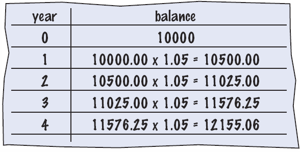
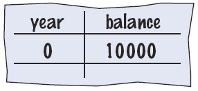
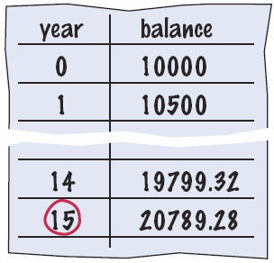

# Chapter One: Introduction

A Short Introduction to Hardware, Software, and Algorithm Development

[← Back to Course Index](../table-of-contents.md)

---

## Chapter Goals

In this chapter you will **learn**:

- About computer hardware, software, and programming
- How to write and execute your first Python program
- How to diagnose and fix programming errors
- How to use pseudocode to describe an algorithm

---

## Our First Definition

### Algorithm

An **algorithm** is a step-by-step description of how to solve a problem.

Think of an algorithm as a recipe: it provides clear, sequential instructions that anyone (or any computer) can follow to achieve a specific goal.

---

## Computer Programs

A **computer program** tells a computer the sequence of steps needed to complete a specific task.

Key points about programs:

- The program consists of a very large number of primitive (simple) instructions
- Computers can carry out a wide range of tasks because they can execute different programs
- Each program is designed to direct the computer to work on a specific task

### Programming

**Programming** is the act of designing, implementing, and testing computer programs.

---

## Hardware and Software

The building blocks that make up a computer system can be divided into two main categories: **hardware** and **software**.

---

## Hardware

**Hardware** consists of the physical elements in a computer system.

### Visible Components

Some very visible examples include:
- The monitor
- The mouse
- External storage devices
- The keyboard

### Core Components

**The Central Processing Unit (CPU)** performs program control and data processing.

**Storage devices** include:
- **Memory (RAM)** - Primary storage
- **Secondary storage**:
  - Hard disk
  - Flash drives
  - CD/DVD drives

**Input/Output devices** allow the user to interact with the computer:
- Mouse
- Keyboard
- Printer
- Screen
- And many others...


---

## The CPU

The CPU has two main components:

### 1. The Control Unit

The **control unit** directs operation of the processor:

- All computer resources are managed by the control unit
- It controls communication and coordination between input/output devices
- It reads and interprets instructions and determines the sequence for processing the data
- It provides timing and control signals

### 2. The Arithmetic Logic Unit (ALU)

The **arithmetic logic unit** contains the circuitry to:
- Perform calculations
- Do comparisons

It is the workhorse portion of the computer and its job is to do precisely what the control unit tells it to do.

---

## Storage

There are two types of storage in a computer system:

### Primary Storage

- Composed of memory chips: electronic circuits that can store data as long as it is provided electric power
- Also known as RAM (Random Access Memory)
- Very fast but volatile (data is lost when power is turned off)

### Secondary Storage

- Provides slower, less expensive storage that is **persistent**: the data persists without electric power
- Examples: hard drives, solid-state drives, USB flash drives, CDs/DVDs

### How Programs and Data are Stored

- Computers store both data and programs
- The data and program are located in secondary storage
- When a program is executed, it is loaded into memory (primary storage) where the CPU can access it quickly

---

## Memory

### Understanding Memory Structure

A simple way to envision primary memory is a table of cells:
- All cells are the same size (one byte)
- Each cell contains a unique address beginning with 0
- The CPU can read from or write to any cell by its address

### Memory Capacity

The "typical" computer has a main memory ranging from 4 gigabytes (GB) to 32 GB.

### Understanding Memory Sizes

How big is a gigabyte? Let's break it down:

- **A bit** is the smallest unit (0 or 1)
- **A byte** is 8 bits
- **A kilobyte (KB)** is 1,024 bytes, or "about 1 thousand bytes"
- **A megabyte (MB)** is 1,048,576 bytes, or "about 1 million bytes"
- **A gigabyte (GB)** is 1,073,741,824 bytes, or "about 1 billion bytes"

> **Note:** Computer scientists use powers of 2 (binary), so 1 KB = 2^10 = 1,024 bytes, not exactly 1,000 bytes.

---

## Executing a Program

Here's what happens when a program runs:

1. **Storage**: Program instructions and data (such as text, numbers, audio, or video) are stored in digital format

2. **Loading**: When a program is started, it is brought into memory, where the CPU can read it

3. **Execution**: The CPU runs the program one instruction at a time

4. **Interaction**: The program may react to user input

5. **Processing**: The instructions and user input guide the program execution

6. **Output**: The CPU reads data (including user input), modifies it, and writes it back to:
   - Memory
   - The screen
   - Secondary storage

---

## Software

**Software** is a sequence of instructions and decisions implemented in some language and translated to a form that can be executed or run on the computer.

### Examples of Software

- **Application programs**: Microsoft Word, web browsers, games
- **System software**: Operating systems (Windows, macOS, Linux)
- **Device drivers**: Software that allows hardware to communicate with the operating system

### How Software Works

- Software is typically realized as an application program
- Computers execute very basic instructions in rapid succession
- The basic instructions can be grouped together to perform complex tasks
- **Programming** is the act of designing and implementing computer programs

---

## Algorithms

---

## Introduction to Algorithms

If you want a computer to perform a task, you start by writing an **algorithm**.

### What is an Algorithm?

An **algorithm** is:
- A sequence (the order matters!) of actions to take to accomplish the given task
- Like a recipe: it is a set of instructions written in a sequence that achieves a goal

### Why Algorithms Matter

- For complex problems, software developers write an algorithm **before** they attempt to write a computer program
- **For this class, we will ALWAYS write an algorithm for each project**
- Developing algorithms is a fundamental problem-solving skill
- It has uses in many fields outside of Computer Science (mathematics, engineering, business, etc.)

---

## Algorithm: Formal Definition

An **algorithm** describes a sequence of steps that is:

### 1. Unambiguous

- No "assumptions" are required to execute the algorithm
- The algorithm uses precise instructions
- Each step is clearly defined

### 2. Executable

- The algorithm can be carried out in practice
- Each step can actually be performed

### 3. Terminating

- The algorithm will eventually come to an end, or halt
- It doesn't run forever (unless that's the intended behavior)

---

## Problem Solving: Algorithm Design

Algorithms are simply **plans**—detailed plans that describe the steps to solve a specific problem.

### Algorithms You Already Know

You already know quite a few algorithms:

- Calculate the area of a circle: `area = π × r²`
- Find the length of the hypotenuse of a triangle: `c = √(a² + b²)`

### More Complex Problems

Some problems are more complex and require more steps:

- Calculate π to 100 decimal places
- Calculate the trajectory of a missile
- Sort a list of 1 million numbers

The key is breaking down complex problems into smaller, manageable steps.

---

## A Simple Example: Getting Orange Juice

Here's a simple algorithm to get yourself a drink of orange juice.

**For simplicity, assume:**
- You have a clean glass in the cabinet
- You have orange juice in your refrigerator

**Algorithm:**

1. Get a glass from your cabinet
2. Go to the refrigerator and get the orange juice container
3. Open the orange juice container
4. Pour the orange juice from the container into the glass
5. Put the orange juice container back in the refrigerator
6. Drink your juice

Notice how each step is:
- **Unambiguous**: Clear what to do
- **Executable**: Can actually be performed
- **Terminating**: Will eventually finish

---

## Second Example: Selecting a Car

### Problem Statement

You have the choice of buying two cars:
- One is more fuel efficient than the other, but also more expensive
- You know the price and fuel efficiency (in miles per gallon, mpg) of both cars
- You plan to keep the car for ten years

**Question:** Which car is the better deal?

---

## Developing the Algorithm

When developing an algorithm, we follow a systematic approach. Let's break down the car selection problem step by step.

### Step 1: Understand the Problem

Before we can solve any problem, we need to make sure we fully understand what we're being asked to do. In this case:
- We need to compare two cars
- We need to determine which one is the better financial deal over 10 years
- "Better deal" means the car with the lower total cost (purchase price + operating costs)

### Step 2: Determine the Inputs and Outputs

From the problem statement we know:

**Inputs:**
- Car 1: Purchase price, Fuel Efficiency
- Car 2: Purchase price, Fuel Efficiency
- Price per gallon = $4.00
- Annual miles driven = 15,000
- Length of time = 10 years

**What we need to calculate:**
- Annual fuel consumed for each car
- Annual fuel cost for each car
- Operating cost for each car
- Total cost of each car

**Output:**
- The car with the lowest total cost

### Step 3: Break Down the Problem

Break down the problem into smaller tasks:

- **Calculate total cost** for each car
- To calculate the total cost, we need to calculate the operating cost
- The operating cost depends on the annual fuel cost
- The annual fuel cost = price per gallon × annual fuel consumed
- The annual fuel consumed = annual miles driven ÷ fuel efficiency

**Algorithm Steps:**

1. For each car, calculate the annual fuel consumed
2. Calculate the annual fuel cost
3. Calculate the total operating cost over 10 years
4. Calculate the total cost (purchase price + operating cost)
5. Compare the total costs and choose the car with the lower cost

---

## Translating the Algorithm to Pseudocode

### What is Pseudocode?

**Pseudocode** is half-way between natural language and a programming language. It uses structured language that's easy to understand but follows programming-like logic.

### The Pseudocode

Here's the complete pseudocode for the car selection problem:

```pseudocode
For each Car, compute the total cost:
    Annual fuel consumed = annual miles driven / fuel efficiency
    Annual fuel cost = price per gallon × annual fuel consumed
    Operating cost = Length of time × annual fuel cost
    Total cost = purchase price + operating cost

If total cost1 < total cost2:
    Choose Car1
Else:
    Choose Car2
```

---

## Bank Account Example

### Problem Statement

You put $10,000 into a bank account that earns 5 percent interest per year. 

**Question:** How many years does it take for the account balance to be double the original ($20,000)?

### How Would You Solve It?

There are several approaches:

1. **Manual method**: Make a table, add lines until done
2. **Use a spreadsheet**: Write a formula per line, based on the line above
3. **Write a program**: Automate the calculation



---

## Developing the Algorithm

When developing an algorithm, we follow a systematic approach. Let's break down the bank account problem step by step.

### Step 1: Understand the Problem

Before we can solve any problem, we need to make sure we fully understand what we're being asked to do. In this case:
- We start with $10,000 in a bank account
- The account earns 5% interest per year
- We need to find out how many years it takes for the balance to reach $20,000 (double the original)
- This is a repetitive calculation problem - we need to keep calculating year by year until we reach the goal

### Step 2: Determine the Inputs and Outputs

From the problem statement we know:

**Inputs:**
- Initial balance = $10,000
- Interest rate = 5% per year (or 0.05 as a decimal, or 1.05 as a multiplier)
- Target balance = $20,000 (double the original)

**What we need to calculate:**
- Year-by-year balance
- Number of years until balance reaches $20,000

**Output:**
- The number of years it takes for the balance to double

### Step 3: Break Down the Problem

Break down the problem into smaller tasks:

- We need to start with initial values (year = 0, balance = $10,000)
- We need to repeat a calculation until a condition is met (balance >= $20,000)
- Each iteration: add 1 to the year, multiply balance by 1.05
- When the condition is met, report the year value

**Algorithm Steps:**

1. Start with a year value of 0 and a balance of $10,000
2. Repeat the following while the balance is less than $20,000:
   - Add 1 to the year value
   - Multiply the balance by 1.05 (5% increase)
3. Report the final year value as the answer




---

## Translating the Algorithm to Pseudocode

### What is Pseudocode?

**Pseudocode** is half-way between natural language and a programming language. It uses structured language that's easy to understand but follows programming-like logic.

### The Pseudocode

Here's the complete pseudocode for the bank account problem:

```pseudocode
Set the year value to 0
Set the balance to $10,000

While the balance is less than $20,000:
    Add 1 to the year value
    Multiply the balance by 1.05

Report the final year value as the answer
```

The pseudocode is easily translated into Python (which we'll do later in the course).

---

## The Python Language

### History

Python was created by **Guido van Rossum**, a Dutch programmer, who began working on it in December 1989 as a Christmas holiday project. The first version was released in 1991.

**The Name "Python"**: Contrary to popular belief, Python is not named after the snake! Van Rossum was a fan of the British comedy group **Monty Python's Flying Circus**, and he wanted a name that was short, unique, and slightly mysterious.

### Why Python Was Created

Van Rossum was working at the **Centrum Wiskunde & Informatica (CWI)** in the Netherlands when he became frustrated with the limitations of existing programming languages. He wanted a language that would be **easy to read and write**, have a **simple and consistent syntax**, be **powerful enough** for real-world applications, and allow **rapid development**.

Python follows a design philosophy emphasizing **readability** and **simplicity**. The language's guiding principles (known as "The Zen of Python") prioritize code that is easy to read, understand, and maintain.

### Key Features

Python has become popular because of several key features:

- **Simple and clean syntax**: Much simpler than Java, C, and C++ (making it easier to learn)
- **Interpreted language**: No compilation step needed—write and run immediately
- **High-level language**: Handles memory management and low-level details automatically
- **Dynamically typed**: No need to declare variable types
- **Extensive standard library**: "Batteries included" philosophy—many tools built-in
- **Cross-platform**: Runs on Windows, macOS, Linux, and more
- **Large ecosystem**: Thousands of third-party packages available via PyPI (Python Package Index)
- **Great community**: Active, helpful community with extensive documentation

### Python's Popularity Today

Python is consistently ranked among the top programming languages because it's used for:
- **Web development** (Django, Flask)
- **Data science and machine learning** (NumPy, Pandas, TensorFlow, PyTorch)
- **Scientific computing** (SciPy, Matplotlib)
- **Automation and scripting**
- **Game development** (Pygame)
- **Desktop applications**
- **And much more!**

The Python interpreter reads your program and executes it directly, making it perfect for both learning programming and building real-world applications.

---

## Programming Environments

There are several ways of creating a computer program:

1. **Using an Integrated Development Environment (IDE)**
   - Provides tools for writing, testing, and debugging code
   - Examples: PyCharm, Visual Studio Code, IDLE

2. **Using a text editor**
   - Simple text editors like Notepad, TextEdit, or vim
   - Requires running the program from a command line

**For this course, we will use PyCharm IDE throughout.**

---

## IDE Components

The source code editor in an IDE can help programming by:

- **Listing line numbers** of code (makes debugging easier)
- **Color-coding** lines of code (comments, keywords, text, etc.)
- **Auto-indenting** source code (maintains proper structure)
- **Output window** (shows program results and error messages)
- **Debugger** (helps find and fix errors in your code)

---

## The PyCharm IDE


PyCharm is a powerful IDE specifically designed for Python development, with features that make coding easier and more efficient.

---

## Your First Program

The traditional **"Hello World"** program in Python is often the first program students write.


### Important Notes

- We will examine this program in detail in the next section
- **Typing the program into your IDE would be good practice!**
- Be careful of spelling (e.g., `print` vs. `primt`)
- **Python is case sensitive** - `Print` is different from `print`!

---

## Text Editor Programming


You can also use a simple text editor to write your source code.

Once saved as `Hello.py`, you can use a console window to:
- Compile the program (Python does this automatically)
- Run the program

However, using an IDE like PyCharm is recommended for beginners as it provides helpful features and error checking.

---

## Organize Your Work

### File Organization

Your **source code** is stored in `.py` files. Here are some best practices:

1. **Create a folder for this course**
2. **Create one folder per program** inside the course folder
3. **A program can consist of several .py files** (as you'll learn later)
4. **Be sure you know where your IDE stores your files** - you need to be able to find your files!

### Backup Your Files

Always backup your work:
- To a USB flash drive
- To a network drive
- To cloud storage (Google Drive, Dropbox, etc.)

> **Pro Tip:** Use version control (like Git) to track changes and backup your code professionally.

---

## Python Interactive Mode

Python offers two ways to run code:

### 1. Script Mode

Like other languages, you can write/save a complete Python program in a file and let the interpreter execute the instructions all at once.

### 2. Interactive Mode

Alternatively, you can run instructions one at a time using **interactive mode**:

- It allows quick "test programs" to be written
- Interactive mode allows you to write Python statements directly in the console window
- Great for experimenting and learning

To start interactive mode, simply type `python` (or `python3`) in your terminal/command prompt.

---

## Source Code to a Running Program

Here's what happens when you run a Python program:

1. **The compiler** reads your program and generates byte code instructions (simple instructions for the Python Virtual Machine)

2. **The Python Virtual Machine** is a program that is similar to the CPU of your computer - it executes the byte code

3. **Libraries** (e.g., for drawing graphics) are automatically located and included by the virtual machine


---

## Let's Get Started!

### Your First Steps

1. **Open the PyCharm IDE** on your lab computer
2. **We are going to start simple** - as we learn more about Python, we'll use additional features in PyCharm
3. **Follow along** with the examples in this chapter

---

## "Hello World"

### Your First Python Program

Type the following into the Editor:

```python
# My first Python program
print("Hello World!")
```

**Save your file as `hello.py`**

This is "Step Two: Write a simple program" from page 7 in your text.

### Important Reminders

- **Python is case sensitive** - you must be careful about distinguishing between upper and lowercase letters
- You have to enter the upper and lower case letters exactly as they appear above
- The `#` symbol starts a comment (we'll learn more about this)

---

## Analyzing Your First Program

A Python program contains one or more lines of instructions (statements) that will be translated and executed by the interpreter.

```python
# My first Python program
print("Hello World!")
```

### Breaking Down the Program

**Line 1:** `# My first Python program`
- This is a **comment** - a statement that provides descriptive information about the program to programmers
- Comments are ignored by Python when the program runs
- They help humans understand what the code does

**Line 2:** `print("Hello World!")`
- This line contains a **statement** that prints a line of text onscreen: "Hello World!"
- `print()` is a built-in Python function
- `"Hello World!"` is a string (text enclosed in quotes)

---

## Basic Python Syntax: Print

### Using the Python `print()` Function

A **function** is a collection of programming instructions that carry out a particular task (in this case, to print a value onscreen).

**It's code that somebody else wrote for you!** Python provides many built-in functions like `print()` that you can use without having to write them yourself.


---

## Syntax for Python Functions

### How to Call a Function

To use, or **call**, a function in Python you need to specify:

1. **The name of the function** that you want to use (in the previous example, the name was `print`)
2. **Any values (arguments)** needed by the function to carry out its task (in this case, `"Hello World!"`)

### Function Syntax

- Arguments are enclosed in **parentheses**: `print(...)`
- Multiple arguments are separated with **commas**: `print("Hello", "World")`
- A sequence of characters enclosed in quotation marks is called a **string**

---

## More Examples of the print Function

### Example 1: Printing Numerical Values

```python
print(3 + 4)
```

**Output:** `7`

This evaluates the expression `3 + 4` and displays the result.

### Example 2: Passing Multiple Values

```python
print("the answer is", 6 * 7)
```

**Output:** `the answer is 42`

Each value passed to the function is displayed, one after another, with a blank space after each value.

### Example 3: Multiple Print Statements

```python
print("Hello")
print("World!")
```

**Output:**
```
Hello
World!
```

By default, the `print()` function starts a new line after its arguments are printed.

---

## Our Second Program (printtest.py)

Here's a sample program that demonstrates various uses of the `print()` function:

```python
##
#  Sample Program that demonstrates the print function
#

#  Prints 7
print(3 + 4)

#  Print Hello World! on two lines
print("Hello")
print("World!")

#  Print multiple values with a single print function call
print("My favorite numbers are", 3 + 4, "and", 3 + 10)

#  Print with an empty line
print("Goodbye")
print()
print("Hope to see you again")
```

### Expected Output

```
7
Hello
World!
My favorite numbers are 7 and 13
Goodbye

Hope to see you again
```

> **Note:** There's a syntax error in the original code (`"and" 3 + 10` should be `"and", 3 + 10`). The corrected version is shown above.

---

## Errors

There are two categories of errors in programming:

### 1. Compile-time Errors (Syntax Errors)

Also known as **syntax errors**, these occur when you violate the rules of the programming language:

- **Spelling errors**: `primt` instead of `print`
- **Capitalization errors**: `Print` instead of `print`
- **Punctuation errors**: Missing commas, periods, etc.
- **Ordering of statements**: Code in the wrong order
- **Matching errors**: Unmatched parentheses, quotes, brackets

**What happens:**
- No executable program is created by the compiler
- You must correct the first error listed, then compile again
- Repeat until all errors are fixed

### 2. Run-time Errors (Logic Errors)

Also known as **logic errors**, these occur when:

- The program runs, but produces unintended results
- The program may "crash" (stop unexpectedly)
- The program doesn't do what you expected

**What happens:**
- The program compiles successfully
- The error only appears when you run the program

---

## Syntax Errors

Syntax errors are caught by the compiler. Here are some common examples:

### Common Syntax Errors

**1. Miss-capitalize a word:**
```python
Print("Hello World!")
```
**Error:** `NameError: name 'Print' is not defined`

**2. Leave out quotes:**
```python
print(Hello World!)
```
**Error:** `SyntaxError: invalid syntax`

**3. Mismatch quotes:**
```python
print("Hello World!')
```
**Error:** `SyntaxError: EOL while scanning string literal`

**4. Don't match brackets:**
```python
print('Hello'
```
**Error:** `SyntaxError: unexpected EOF while parsing`

### Practice

Type each example above in the PyCharm Python Shell window and observe what error messages are generated. This will help you recognize and fix errors in your own code.

---

## Logic Errors

Logic errors are trickier because the program compiles and runs, but produces incorrect results.

### Common Logic Errors

**1. Divide by zero:**
```python
print(1/0)
```
**Error:** `ZeroDivisionError: division by zero`

**2. Misspell output:**
```python
print("Hello, Word!")  # Should be "World!"
```
**Output:** `Hello, Word!` (no error, but wrong output)

**3. Forget to output:**
If you remove the print statement, the program runs but produces no output.

### Practice

Type each example above in the PyCharm Python Shell window and observe what happens. Notice how some logic errors produce error messages, while others just produce wrong results.

---

## Summary: Computer Basics

- **Computers** rapidly execute very simple instructions
- A **Program** is a sequence of instructions and decisions
- **Programming** is the art (and science) of designing, implementing, and testing computer programs
- The **Central Processing Unit (CPU)** performs program control and data processing
- **Storage devices** include memory and secondary storage (e.g., a USB Flash Drive)

---

## Summary: Python

- **Python** was designed in a way that makes it easier to learn than other programming languages such as Java, C, and C++
- The designer's goal was to give Python simpler and cleaner syntax
- Set aside some time to become familiar with the programming environment that you will use for your class work
- It is important to practice with the tool so you can focus on learning Python
- An **editor** is a program for entering and modifying text, such as a Python program

---

## Summary: Python Syntax

- **Python is case sensitive** - you must be careful about distinguishing between upper and lowercase letters
- The **Python compiler** translates source code into byte code instructions that are executed by the Virtual Machine
- A **function** is called by specifying the function's name and its parameters
- A **string** is a sequence of characters enclosed in quotation marks

---

## Summary: Errors and Pseudocode

- A **compile-time error** (syntax error) is a violation of the programming language rules that is detected by the compiler
- A **run-time error** (logic error) causes a program to take an action that the programmer did not intend
- **Pseudocode** is an informal description of a sequence of steps for solving a problem
- An **algorithm** for solving a problem is a sequence of steps that is unambiguous, executable, and terminating

---

## Key Takeaways

1. **Algorithms** are step-by-step problem-solving plans
2. **Programming** involves designing, implementing, and testing computer programs
3. **Python** is a beginner-friendly language with clean syntax
4. **Practice** is essential - type out the examples and experiment
5. **Errors are normal** - learning to read and fix errors is part of programming

---

## Exercises

Practice what you've learned by completing the exercises:

**[→ Chapter 1 Exercises](excercises.md)**

---

*End of Chapter One*

[← Back to Course Index](../table-of-contents.md)
