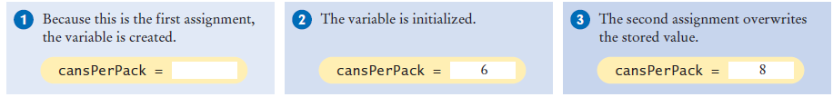
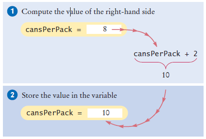
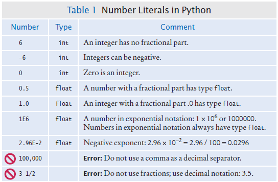
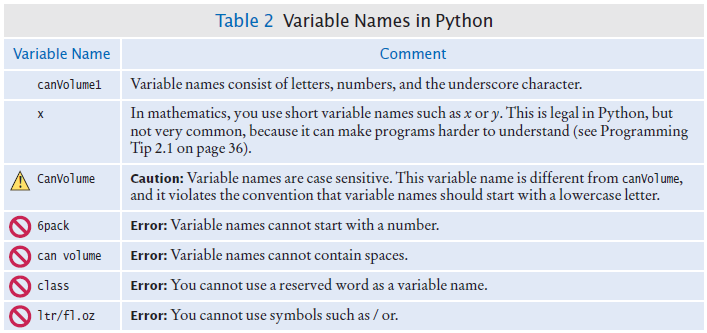
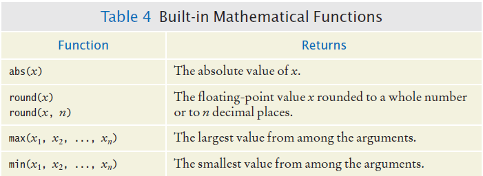
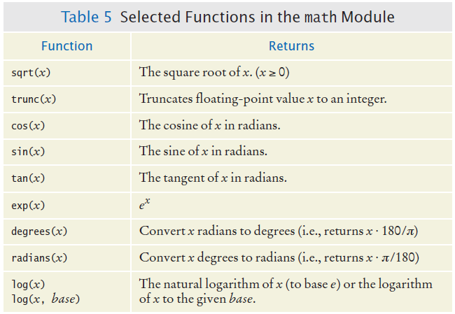
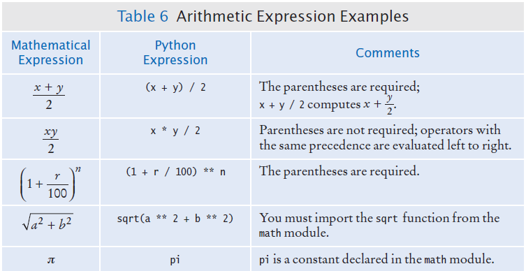
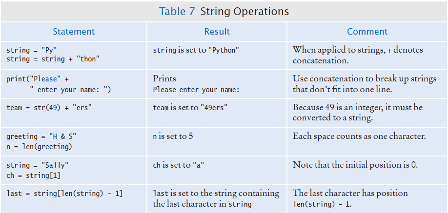
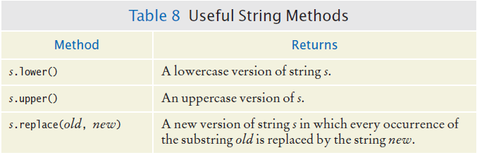

# Chapter Two: Programming with Numbers and Strings

---

## Introduction

Numbers and character strings are important data types in any Python program.

These are the fundamental building blocks we use to build more complex data structures.

In this chapter, you will learn how to work with numbers and text. We will write several simple programs that use them. You will also learn about Python's library system - both the standard library that comes with Python and external libraries that can be installed to extend Python's capabilities.

---

## Chapter Goals

In this chapter you will learn:

- To declare and initialize variables and constants
- To understand the properties and limitations of integers and floating-point numbers
- To appreciate the importance of comments and good code layout
- To write arithmetic expressions and assignment statements
- To create programs that read and process inputs, and display the results
- To learn how to use Python strings
- To understand Python libraries (standard and external) and how to manage them with pip

---

## Chapter Contents

- **2.1 Variables** - Storing and manipulating data
- **2.2 Arithmetic** - Mathematical operations and expressions
- **2.4 Strings** - Working with text data
- **2.5 Input and Output** - Interacting with users and formatting output
- **2.6 External Libraries** - Using pip and third-party packages like requests

---

[← Back to Course Index](../table-of-contents.md)


## 2.1 Variables

### What is a Variable?

A **variable** is a named storage location in a computer program.

There are many different types of variables, each type used to store different things.

You **define** a variable by telling Python:
- What name you will use to refer to it
- The initial value of the variable

You use an **assignment statement** to place a value into a variable.


## Variable Definition

To define a variable, you must specify an initial value.

### The Assignment Statement

Use the **assignment statement** `=` to place a new value into a variable.

```python
cansPerPack = 6   # define & initializes the variable cansPerPack
```

> **Important:** The `=` sign is **NOT** used for comparison. It copies the value on the right side into the variable on the left side. You will learn about the comparison operator in the next chapter.


## Assignment syntax

The value on the right of the '=' sign is assigned to the variable on the left


### Example: Soda Deal

**Problem:** Soft drinks are sold in cans and bottles. A store offers a six-pack of 12-ounce cans for the same price as a two-liter bottle. Which should you buy? (12 fluid ounces equal approximately 0.355 liters.)

**Variables needed:**
- Number of cans per pack (whole number)
- Ounces per can (whole number)
- Ounces per bottle (number with fraction)

### Why Different Types?

There are three different types of data that we will use in this chapter:

- **Integer (int)**: A whole number (no fractional part) - `7`
- **Float**: A number with a fractional part - `8.88`
- **String**: A sequence of characters - `"Bob"`

> **Key Point:** The data type is associated with the **value**, not the **variable**:

```python
cansPerPack = 6    # int
canVolume = 12.0   # float
```


### Updating a Variable (Assigning a Value)

If an existing variable is assigned a new value, that value **replaces** the previous contents of the variable.

**Example:**

```python
cansPerPack = 6
cansPerPack = 8  # The value 6 is replaced with 8
```





### Updating a Variable (Computed)

**Executing the Assignment:**

```python
cansPerPack = cansPerPack + 2
```

**Step by Step:**

1. **Step 1:** Calculate the right-hand side of the assignment. Find the value of `cansPerPack`, and add 2 to it.
2. **Step 2:** Store the result in the variable named on the left side of the assignment operator.




### ⚠️ A Warning About Variable Types

Since the data type is associated with the **value** and not the **variable**, a variable can be assigned different types at different places in a program:

```python
taxRate = 5              # an int
# ... later in the program ...
taxRate = 5.5           # a float
# ... and then ...
taxRate = "Non-taxable"  # a string
```

> **Warning:** If you use a variable and it has an unexpected type, an error will occur in your program. It's best practice to keep the same type for a variable throughout your program.


### Our First Program: Type Testing

**Instructions:**
1. Open PyCharm (our IDE) and create a new file
2. Type in the following code
3. Save the file as `typetest.py`
4. Run the program

```python
# Testing different types in the same variable
taxRate = 5  # int
print(taxRate)

taxRate = 5.5  # float
print(taxRate)

taxRate = "Non-taxable"  # string
print(taxRate)

print(taxRate + 5)  # This will cause an error!
```

> **Note:** Once you have initialized a variable with a value of a particular type, you should take great care to keep storing values of the same type in the variable. The last line will cause a `TypeError` because you cannot add a number to a string.


### A Minor Change

**Try this:** Change the last line to read:

```python
print(taxRate + "??")
```

Save your changes and run the program.

**What is the result?**

When you use the `+` operator with strings, the second argument is **concatenated** (joined) to the end of the first. This works because both operands are strings.

We'll cover string operations in more detail later in this chapter.


## Table 1: Number Literals in Python




### Naming Variables

Variable names should describe the purpose of the variable. For example, `canVolume` is better than `cv`.

**Rules for Variable Names:**

- Variable names must start with a letter or the underscore (`_`) character
- Continue with letters (upper or lower case), digits, or the underscore
- You cannot use other symbols (`?`, `%`, etc.) and spaces are not permitted
- Separate words with **camelCase** notation (e.g., `cansPerPack`)
- Use upper case letters to signify word boundaries
- Don't use **reserved** Python words (like `if`, `for`, `while`, `print`, etc.)


## Table 2: Variable Names in Python




### Programming Tip: Use Descriptive Variable Names

Choose descriptive variable names. Which variable name is more self-descriptive?

```python
canVolume = 0.35  # Clear and descriptive
cv = 0.355        # Unclear - what does 'cv' mean?
```

This is particularly important when programs are written by more than one person.


### Constants

In Python, a **constant** is a variable whose value **should not** be changed after it's assigned an initial value.

It is a good practice to use **all caps** when naming constants:

```python
BOTTLE_VOLUME = 2.0
```

It is good style to use named constants to explain numerical values to be used in calculations. Which is clearer?

```python
totalVolume = bottles * 2                    # What does 2 mean?
totalVolume = bottles * BOTTLE_VOLUME       # Much clearer!
```

A programmer reading the first statement may not understand the significance of the "2".

> **Note:** Python will let you change the value of a constant, but just because you can do it, doesn't mean you should do it!


### Constants: Naming & Style

It is customary to use all **UPPER_CASE** letters for constants to distinguish them from variables. This provides a nice visual cue:

```python
BOTTLE_VOLUME = 2   # Constant
MAX_SIZE = 100      # Constant
taxRate = 5         # Variable
```


### Python Comments

Use comments at the beginning of each program, and to clarify details of the code.

Comments are:
- A courtesy to others
- A way to document your thinking
- Explanations for humans who read your code

The Python interpreter **ignores** comments when executing your program.


### Commenting Code: Style 1

```python
##
#  This program computes the volume (in liters) of a six-pack of soda
#  cans and the total volume of a six-pack and a two-liter bottle
#

# Liters in a 12-ounce can
CAN_VOLUME = 0.355

# Liters in a two-liter bottle.
BOTTLE_VOLUME = 2

# Number of cans per pack.
cansPerPack = 6

# Calculate total volume in the cans.
totalVolume = cansPerPack * CAN_VOLUME
print("A six-pack of 12-ounce cans contains", totalVolume, "liters.")

# Calculate total volume in the cans and a 2-liter bottle.
totalVolume = totalVolume + BOTTLE_VOLUME
print("A six-pack and a two-liter bottle contain", totalVolume, "liters.")
```


### Commenting Code: Style 2

```python
##
#  This program computes the volume (in liters) of a six-pack of soda
#  cans and the total volume of a six-pack and a two-liter bottle
#

## CONSTANTS ##
CAN_VOLUME = 0.355   # Liters in a 12-ounce can
BOTTLE_VOLUME = 2     # Liters in a two-liter bottle

# Number of cans per pack.
cansPerPack = 6

# Calculate total volume in the cans.
totalVolume = cansPerPack * CAN_VOLUME
print("A six-pack of 12-ounce cans contains", totalVolume, "liters.")

# Calculate total volume in the cans and a 2-liter bottle.
totalVolume = totalVolume + BOTTLE_VOLUME
print("A six-pack and a two-liter bottle contain", totalVolume, "liters.")
```


### Multiline Comments

Unlike other programming languages such as JavaScript, Java, and C++ which use `/*...*/` for multi-line comments, there's no built-in mechanism for multi-line comments in Python.

**Option 1:** Insert a `#` for each line:

```python
# This is a comment
# written in more than
# just one line
```

**Option 2:** Use **docstrings** (triple quotes). Since Python will ignore string literals that are not assigned to a variable, you can add a multiline string and place your comment inside it:

```python
""" This is a comment written in more than just one line """
print("Hello, World!")
```

**Output:**
```
Hello, World!
```

### Undefined Variables

You must **define a variable before you use it** (i.e., it must be defined somewhere above the line of code where you first use the variable).

**❌ Incorrect order:**

```python
canVolume = 12 * literPerOunce  # Error! literPerOunce not defined yet
literPerOunce = 0.0296
```

**✅ Correct order:**

```python
literPerOunce = 0.0296
canVolume = 12 * literPerOunce  # Now literPerOunce is defined
```


## 2.2 Arithmetic

### Basic Arithmetic Operations

Python supports all of the basic arithmetic operations:

- **Addition**: `+`
- **Subtraction**: `-`
- **Multiplication**: `*`
- **Division**: `/`

You write your expressions similar to mathematics, but with Python syntax.


### Operator Precedence

Precedence is similar to Algebra, following **PEMDAS**:

1. **P**arentheses
2. **E**xponent
3. **M**ultiply/**D**ivide (left to right)
4. **A**dd/**S**ubtract (left to right)


### Mixing Numeric Types

If you mix integer and floating-point values in an arithmetic expression, the result is a **floating-point value**:

```python
7 + 4.0    # Yields the floating value 11.0
```

> **Remember:** If you mix **strings** with integer or floating-point values, the result is an error (unless you're using string concatenation with `+`).


### Powers (Exponentiation)

Double stars `**` are used to calculate an exponent:

```python
# Example: Calculate compound interest
# b * ((1 + r / 100) ** n)
result = b * ((1 + r / 100) ** n)
```


### Floor Division

When you divide two integers with the `/` operator, you get a **floating-point value**:

```python
7 / 4  # Yields 1.75
```

We can also perform **floor division** using the `//` operator. The `//` operator computes the quotient and **discards the fractional part**:

```python
7 // 4  # Evaluates to 1
```

This evaluates to `1` because 7 divided by 4 is 1.75, and the fractional part (0.75) is discarded.


### Calculating a Remainder (Modulus)

If you are interested in the **remainder** of dividing two integers, use the `%` operator (called **modulus**):

```python
remainder = 7 % 4  # The value of remainder will be 3
```

This is sometimes called **modulo division**.


### Example: Converting Pennies to Dollars and Cents

**Instructions:**
1. Open a new file in the PyCharm IDE
2. Type in the following code
3. Save the file
4. Run the file

```python
# Convert pennies to dollars and cents
pennies = 1729
dollars = pennies // 100  # Calculates the number of dollars
cents = pennies % 100     # Calculates the number of pennies
print("I have", dollars, "and", cents, "cents")
```

**What is the result?**


### Integer Division and Remainder Examples

Handy to use for making change:

```python
pennies = 1729
dollars = pennies // 100  # 17 (using floor division)
cents = pennies % 100      # 29 (remainder)
```


### Calling Functions

Recall that a **function** is a collection of programming instructions that carry out a particular task.

The `print()` function can display information, but there are many other functions available in Python.

> **Important:** When calling a function, you must provide the correct number of arguments. The program will generate an error message if you don't.


### Calling Functions That Return a Value

Most functions **return a value**. That is, when the function completes its task, it passes a value back to the point where the function was called.

**Example:**

```python
abs(-173)  # Returns the value 173
```

The value returned by a function can be stored in a variable:

```python
distance = abs(x)
```

You can use a function call as an argument to the `print()` function:

```python
print(abs(-173))  # Prints 173
```

> **Try it:** Go to the Python shell window in PyCharm and type: `print(abs(-173))`


## Built in Mathematical Functions




### Python Libraries (Modules)

A **library** is a collection of code, written by someone else, that is ready for you to use in your program.

A **standard library** is a library that is considered part of the language and must be included with any Python system.

Python's standard library is organized into **modules**. Related functions and data types are grouped into the same module.

Functions defined in a module must be **explicitly loaded** into your program before they can be used.


### Using Functions from the Math Module

For example, to use the `sqrt()` function, which computes the square root of its argument:

```python
# First include this statement at the top of your program file
from math import sqrt

# Then you can simply call the function as
y = sqrt(x)
```

### Other Ways to Import Modules

```python
from math import sqrt, sin, cos   # Imports only the functions listed
from math import *                # Imports all functions from the module (use with caution)
import math                       # Imports the module itself (all functions accessible via math.function_name)
```

**Key Differences:**

- `from math import sqrt, sin, cos` - Imports only the specified functions directly into your namespace. Call them as `sqrt(x)`, `sin(x)`, etc.

- `from math import *` - Imports ALL functions from the module directly into your namespace. Call them as `sqrt(x)`, `sin(x)`, etc. (Not recommended - can cause naming conflicts)

- `import math` - Imports the module object itself. All functions are accessible, but you must use the module name prefix. Call them as `math.sqrt(x)`, `math.sin(x)`, etc. (Recommended for clarity)

**Example:**
```python
y = math.sqrt(x)  # Note the 'math.' prefix when using 'import math'
```

### Built-in Functions

**Built-in functions** are a small set of functions that are defined as a part of the Python language. They can be used **without importing any modules**.

Examples: `print()`, `len()`, `abs()`, `int()`, `float()`, `str()`


## Functions from the Math Module




### Floating-Point to Integer Conversion

You can use the functions `int()` and `float()` to convert between integer and floating-point values:

```python
balance = total + tax   # balance: float
dollars = int(balance)  # dollars: integer
```

> **Note:** You lose the fractional part of the floating-point value (no rounding occurs). Use `round()` if you need rounding.


## Arithmetic Expressions




### Unbalanced Parentheses

**Consider the expression:**

```python
((a + b) * t / 2 * (1 - t)  # Missing closing parenthesis
```

**What is wrong with the expression?**

**Now consider this expression:**

```python
(a + b) * t) / (2 * (1 - t)  # Has 3 "(" and 3 ")", but still incorrect
```

This expression has three `(` and three `)`, but it still is not correct because the parentheses are not properly matched.

**Rules:**
- At any point in an expression, the count of `(` must be greater than or equal to the count of `)`
- At the end of the expression, the two counts must be the same


### Additional Programming Tips

**Use Spaces in Expressions:**

```python
totalCans = fullCans + emptyCans  # Easier to read
```

Is easier to read than:

```python
totalCans=fullCans+emptyCans  # Harder to read
```

## 2.4 Strings

### What is a String?

Start with some simple definitions:

- **Text** consists of **characters**
- **Characters** are letters, numbers, punctuation marks, spaces, etc.
- A **string** is a sequence of characters

In Python, string literals are specified by enclosing a sequence of characters within a matching pair of either **single** or **double quotes**:

```python
print("This is a string.", 'So is this.')
```

By allowing both types of delimiters, Python makes it easy to include an apostrophe or quotation mark within a string:

```python
message = 'He said "Hello"'
message2 = "It's a beautiful day"
```

> **Remember:** Use matching pairs of quotes - single with single, double with double.


### String Length

The number of characters in a string is called the **length** of the string. (For example, the length of `"Harry"` is 5).

You can compute the length of a string using Python's `len()` function:

```python
length = len("World!")  # length is 6
```

A string of length 0 is called the **empty string**. It contains no characters and is written as `""` or `''`.


### String Concatenation ("+")

You can 'add' one string onto the end of another using the `+` operator:

```python
firstName = "Harry"
lastName = "Morgan"
name = firstName + lastName  # Result: "HarryMorgan"
print("my name is:", name)
```

**You wanted a space in between the two names?**

```python
name = firstName + " " + lastName  # Result: "Harry Morgan"
```

Using `+` to concatenate strings is an example of a concept called **operator overloading**. The `+` operator performs different functions depending on the types of variables (addition for numbers, concatenation for strings).


### String Repetition ("*")

You can also produce a string that is the result of repeating a string multiple times.

**Example:** Suppose you need to print a dashed line. Instead of specifying a literal string with 50 dashes, you can use the `*` operator:

```python
dashes = "-" * 50
```

This results in the string:

```
"-------------------------------------------------"
```

The `*` operator is also **overloaded** - it multiplies numbers but repeats strings.


### Converting Numbers to Strings

Use the `str()` function to convert numbers to strings:

```python
balance = 888.88
dollars = 888

balanceAsString = str(balance)   # "888.88"
dollarsAsString = str(dollars)   # "888"

print(balanceAsString)
print(dollarsAsString)
```

**To turn a string containing a number into a numerical value**, we use the `int()` and `float()` functions:

```python
id = int("1729")        # Converts to integer: 1729
price = float("17.29")  # Converts to float: 17.29

print(id)
print(price)
```

> **Important:** This conversion is essential when the strings come from **user input** (which we'll cover in section 2.5).


### Accessing Characters in a String

Each character inside a string has an **index number** (starting from 0):

**Example 1:**
```
| 0 | 1 | 2 | 3 | 4 | 5 | 6 | 7 | 8 | 9 |
| c | h | a | r | s |   | h | e | r | e |
```

**Example 2:**
```
| 0 | 1 | 2 | 3 | 4 |
| H | a | r | r | y |
```

**Key Points:**
- The first character is at index **zero (0)**
- The `[]` operator returns a character at a given index inside a string

**Example:**

```python
name = "Harry"
start = name[0]  # 'H'
last = name[4]   # 'y'
``` 

## String Operations




### Methods

In computer programming, an **object** is a software entity that represents a value with certain behavior.

- The value can be simple, such as a string, or complex, like a graphical window or data file
- The behavior of an object is given through its **methods**

A **method** is a collection of programming instructions to carry out a specific task – similar to a function, but:
- Unlike a **function**, which is a standalone operation, a **method** can only be applied to an object of the type for which it was defined
- Methods are specific to a type of object
- Functions are general and can accept arguments of different types

**Example:** You can apply the `upper()` method to any string:

```python
name = "John Smith"
uppercaseName = name.upper()  # Sets uppercaseName to "JOHN SMITH"
```


## Some Useful String Methods




### String Escape Sequences

**How would you print a double quote?**

Preface the `"` with a `\` inside the double-quoted string:

```python
print("He said \"Hello\"")  # Output: He said "Hello"
```

**OK, then how do you print a backslash?**

Preface the `\` with another `\`:

```python
print("C:\temp\secret.txt")  # Output: C:	emp\secret.txt (WRONG - \t is interpreted as tab!)
print("C:\\temp\\secret.txt")  # Output: C:\temp\secret.txt (CORRECT - backslashes are escaped)
```

**What happened in the first example?**
- Python interpreted `\t` as a **tab character** (a valid escape sequence)
- This is why you see a tab space between `C:` and `emp` in the output
- To print a literal backslash, you must escape it with `\\`

**Important:** Always use `\\` when you need a literal backslash in a string, especially for file paths on Windows.

**Special characters inside strings:**

Output a newline with `\n`:

```python
print("*\n**\n***\n")
```

**Output:**
```
*
**
***
```


## 2.5 Input and Output

### Reading Input from the User

You can read a string from the console with the `input()` function:

```python
name = input("Please enter your name: ")
```

**Converting a string to a number:**

If numeric (rather than string) input is needed, you can convert it:

```python
age = int(input("Please enter age: "))
```

The above is equivalent to doing it in two steps:

```python
aString = input("Please enter age: ")  # String input
age = int(aString)                      # Converted to int
```


### String Formatting in Python

**Why Format Strings?**
- To create readable and meaningful output
- Combine text and variables dynamically
- Control the appearance of numeric values (e.g., decimals, alignment)

**Three Main Methods of String Formatting:**

1. Old `%` Operator (Legacy) - Not recommended for new code
2. `.format()` Method
3. **f-strings** (Modern and Recommended)

#### The Old % Operator

Uses `%` for placeholders:
- `%s` for strings
- `%d` for integers
- `%.2f` for floating-point numbers (2 decimal places)

**Example:**

```python
price = 1.2345
print("Price per liter: %.2f" % price)  # Output: Price per liter: 1.23
```

#### The .format() Method

Use `{}` as placeholders in the string. Supports positional and named arguments:

```python
price = 1.2345
print("Price per liter: {:.2f}".format(price))  # Output: Price per liter: 1.23

# Positional Arguments
print("{} is {} years old.".format("Alice", 25))  # Output: Alice is 25 years old.

# Named Arguments
print("{name} is {age} years old.".format(name="Alice", age=25))
```

#### f-strings (Formatted String Literals) - Recommended

Introduced in Python 3.6. Use `f""` to directly embed expressions inside curly braces:

```python
price = 1.2345
print(f"Price per liter: {price:.2f}")  # Output: Price per liter: 1.23

name = "Alice"
age = 25
print(f"{name} is {age} years old.")  # Output: Alice is 25 years old.
```

> **Recommendation:** Use f-strings for new code - they're the most readable and efficient.

### Example Program: Volume2.py

This example demonstrates input, processing, and formatted output. See the code example in your textbook (bookcode-py-3\ch02\sec05_03\volume2.py).

```python
##
#  This program prints the price per ounce for a six-pack of cans.
#

# Define constant for pack size.
CANS_PER_PACK = 6

# Obtain price per pack and can volume.
userInput = input("Please enter the price for a six-pack: ")
packPrice = float(userInput)

userInput = input("Please enter the volume for each can (in ounces): ")
canVolume = float(userInput)

# Compute pack volume. 
packVolume = canVolume * CANS_PER_PACK

# Compute and print price per ounce.
pricePerOunce = packPrice / packVolume
print("Price per ounce: %8.2f" % pricePerOunce)
```

---

## 2.6 External Libraries

### What are External Libraries?

Python's standard library is powerful, but sometimes you need extra functionality.

**External libraries** (also called **third-party libraries**) extend Python's capabilities in specialized areas. These libraries can be installed and managed to simplify your development process.

**Examples of External Libraries:**
- `requests` - for making HTTP requests
- `numpy` - for numerical computations
- `matplotlib` - for plotting graphs
- `pandas` - for data analysis
- And thousands more!

### Why Use External Libraries?

- **Save time** by reusing code written by others
- **Access advanced functionality** not in the Python standard library
- **Avoid reinventing the wheel** - many problems are already solved with existing libraries
- **Improve code readability and maintainability**

**Example:** Instead of writing HTTP requests from scratch, use `requests` to handle complex networking tasks.

### How to Find External Libraries?

Python libraries are hosted in the **Python Package Index (PyPI)** at [https://pypi.org](https://pypi.org).

You can search for libraries using keywords or functions. PyPI is the official repository for Python packages.

### Managing External Libraries in Projects

Managing dependencies (external libraries) is crucial for project stability. You need a system to install, upgrade, and remove libraries as your project evolves.

This is where **pip** comes in - the standard package manager for Python.

**Key Terms:**
- **Dependency**: A library your project relies on
- **Virtual Environment**: An isolated space to manage dependencies without affecting global settings

### Introduction to pip

**pip** is the default tool for installing and managing external libraries in Python.

It allows you to:
- Install new libraries
- Update libraries
- Uninstall libraries
- List installed packages

**Example:** In PyCharm's "Terminal" (accessed using the Terminal button on the bottom left of the screen), you can run:

```bash
pip list
```

This lists the currently installed packages in your current **venv** (Virtual Environment).

### Installing Libraries with pip

Use `pip install` to add external libraries to your environment. Libraries are downloaded from PyPI and installed in your Python environment.

**Example:**

```bash
pip install requests
```

This will download and install the `requests` library as well as any dependencies required by that package.

> **Note:** In PyCharm, you can also use the "Python Packages" menu (button on the bottom left) to see currently installed packages and install new ones.

### Uninstalling and Updating Libraries

**To uninstall** a library that you no longer need:

```bash
pip uninstall <package_name>
```

**To update** a library to its latest version:

```bash
pip install --upgrade <package_name>
```

### The requests Library

The **requests** package in Python is a popular library used to send HTTP requests. It abstracts the complexities of making requests behind a simple API, allowing you to interact with web services, APIs, or websites using standard HTTP methods like GET, POST, PUT, DELETE, etc.

**To install the requests package**, run this command in your PyCharm terminal:

```bash
pip install requests
```

**Learn more about HTTP Requests:**
- [HTTP Overview](https://developer.mozilla.org/en-US/docs/Web/HTTP/Overview)
- [HTTP Methods](https://developer.mozilla.org/en-US/docs/Web/HTTP/Methods)
- [HTTP Status Codes](https://developer.mozilla.org/en-US/docs/Web/HTTP/Status)

### Example: Using the requests Library

A simple example of a GET request using `requests`:

```python
import requests

# Send a GET request
response = requests.get('https://jsonplaceholder.typicode.com/posts')

# Check if the request was successful
if response.status_code == 200:
    # Print the response content
    print(response.json())  # Returns the response as JSON
else:
    print("Failed to retrieve data: " + str(response.status_code))
```

This example:
1. Imports the `requests` library
2. Sends a GET request to a test API endpoint
3. Checks the status code (200 means success)
4. Prints the JSON response if successful

---

## Chapter Summary

### Variables

- A **variable** is a storage location with a name
- When defining a variable, you must specify an initial value
- By convention, variable names should start with a lower case letter
- An assignment statement stores a new value in a variable, replacing the previously stored value

### Operators

- The assignment operator `=` does **not** denote mathematical equality
- Variables whose initial value should not change are typically capitalized by convention (constants)
- The `/` operator performs division yielding a value that may have a fractional value
- The `//` operator performs floor division - the remainder is discarded
- The `%` operator computes the remainder of a floor division (modulus)

### Python Functions and Modules

- The Python library declares many mathematical functions, such as `sqrt()` and `abs()`
- You can convert between integers, floats, and strings using: `int()`, `float()`, `str()`
- Python libraries are grouped into **modules**. Use the `import` statement to use functions from a module
- Use the `input()` function to read keyboard input in a console window
- Use format specifiers (f-strings recommended) to specify how values should be formatted

### External Libraries

- **External libraries** (third-party libraries) extend Python's capabilities beyond the standard library
- **pip** is the standard package manager for installing, updating, and uninstalling external libraries
- Libraries are hosted in the **Python Package Index (PyPI)** at pypi.org
- Use `pip install <package_name>` to install libraries
- Use `pip list` to see installed packages
- Use `pip uninstall <package_name>` to remove libraries
- Use `pip install --upgrade <package_name>` to update libraries
- The `requests` library is a popular example for making HTTP requests

### Strings

- **Strings** are sequences of characters
- The `len()` function yields the number of characters in a string
- Use the `+` operator to **concatenate** strings (put them together)
- To concatenate, the `+` operator requires both arguments to be strings. Numbers must be converted using `str()`
- String index numbers are counted starting with **0**
- Use the `[]` operator to extract individual characters from a string
- Strings have many useful **methods** like `upper()`, `lower()`, `strip()`, etc.

---

## Key Takeaways

1. **Variables** store data and can change their values during program execution
2. **Constants** (UPPER_CASE) should not be changed after initialization
3. **Comments** help document your code for yourself and others
4. **Arithmetic operations** follow PEMDAS precedence rules
5. **Strings** are sequences of characters that can be manipulated with operators and methods
6. **Type conversion** is essential when working with user input
7. **f-strings** are the modern, recommended way to format output
8. **External libraries** extend Python's functionality - use `pip` to manage them

---

## Additional Resources

- [Python Multiline Comments](https://www.freecodecamp.org/news/python-multiline-comment-how-to-comment-out-multiple-lines-in-python/)
- [Python Comments Guide](https://www.w3schools.com/python/python_comments.asp)

---

## Exercises

Practice what you've learned by completing the exercises:

**[→ Chapter 2 Exercises](excercises.md)**

---

*End of Chapter Two*

[← Back to Course Index](../table-of-contents.md)
