# Chapter Four: Loops

---

## Introduction

In this chapter, you will learn about loop statements in Python, as well as techniques for writing programs that simulate activities in the real world.

---

## Chapter Goals

In this chapter you will learn:

- To implement `while` and `for` loops
- To hand-trace the execution of a program
- To become familiar with common loop algorithms
- To understand nested loops
- To implement programs that read and process data sets
- To use a computer for simulations

---

[← Back to Course Index](../table-of-contents.md)

## 4.1 The `while` Loop

### What is a `while` Loop?

A loop executes instructions repeatedly while a condition is `True`.

**Examples of loop applications:**
- Calculating compound interest
- Repeating a prompt until the user enters valid input
- Drawing tiles
- Processing a set of items (e.g., a list of numbers or lines in a file)

### Planning the `while` Loop

```python
balance = 10.0
target = 100.0
year = 0
rate = 0.025

while balance < target:
    year = year + 1
    interest = balance * rate / 100
    balance = balance + interest
```

A loop executes instructions repeatedly while a condition is `True`.

### Syntax 4.1: The `while` Statement

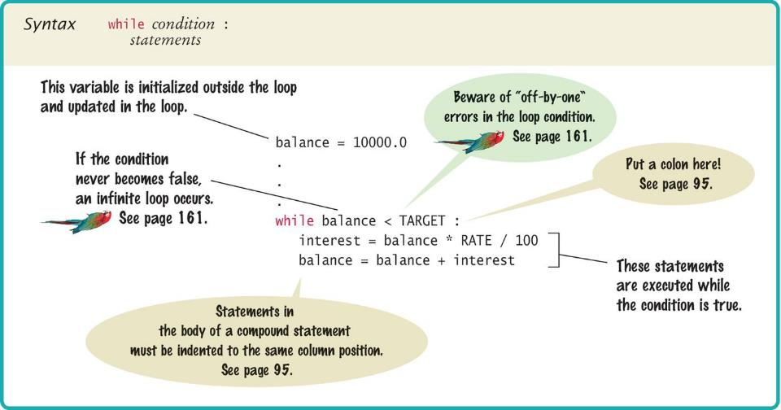

### Count-Controlled Loops

A `while` loop that is controlled by a counter:

```python
counter = 1                 # Initialize the counter

while counter <= 10:       # Check the counter
    print(counter)
    counter = counter + 1  # Update the loop variable
```

### Event-Controlled Loops

A `while` loop that is controlled by an event:

```python
balance = INITIAL_BALANCE   # Initialize the loop variable

while balance <= TARGET:   # Check the loop variable
    year = year + 1
    balance = balance * 2  # Update the loop variable
```

### Execution of the Loop

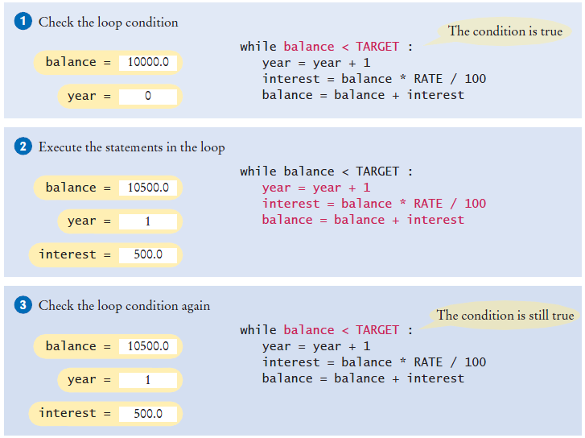

")

### doubleinv.py Example

```python
##
#  This program computes the time required to double an investment.
#

# Create constant variables.
RATE = 5.0
INITIAL_BALANCE = 10000.0
TARGET = 2 * INITIAL_BALANCE

# Initialize variables used with the loop.
balance = INITIAL_BALANCE
year = 0

# Count the years required for the investment to double.
while balance < TARGET :
   year = year + 1
   interest = balance * RATE / 100
   balance = balance + interest

# Print the results.
print("The investment doubled after", year, "years.")
```

**Key points:**
- Declare and initialize a variable outside of the loop to count `year`
- Increment the `year` variable each time through

### Investment Example

**Instructions:**
1. Open the file: `doubleinv.py`
2. Run the program with several test cases
3. The program will prompt you for a rate
4. Enter a mix of valid and invalid rates

### ⚠️ Common Error: Incorrect Test Condition

The loop body will only execute if the test condition is `True`.

If `bal` is initialized as less than the `TARGET` and should grow until it reaches `TARGET`, which version will execute the loop body?

```python
# ✅ Correct - executes when balance is less than target
while bal < TARGET:
    year = year + 1
    interest = bal * RATE
    bal = bal + interest

# ❌ Incorrect - would never execute if balance starts below target
while bal >= TARGET:
    year = year + 1
    interest = bal * RATE
    bal = bal + interest
```

### ⚠️ Common Error: Infinite Loops

The loop body will execute until the test condition becomes `False`.

**What if you forget to update the test variable?**

`bal` is the test variable (`TARGET` doesn't change). You will loop forever! (or until you stop the program)

```python
# ❌ Infinite loop - bal is never updated!
while bal < TARGET:
    year = year + 1
    interest = bal * RATE
    # Missing: bal = bal + interest
```

### ⚠️ Common Error: Off-by-One Errors

A counter variable is often used in the test condition.

Your counter can start at 0 or 1, but programmers often start a counter at 0.

**If I want to paint all 5 fingers on one hand, when am I done?**

- If you start at 0, use `<`
- If you start at 1, use `<=`

**Example starting at 0:**
```python
finger = 0
FINGERS = 5

while finger < FINGERS:
    # paint finger
    finger = finger + 1
# Values: 0, 1, 2, 3, 4 (5 iterations)
```

**Example starting at 1:**
```python
finger = 1
FINGERS = 5

while finger <= FINGERS:
    # paint finger
    finger = finger + 1
# Values: 1, 2, 3, 4, 5 (5 iterations)
```

### `while` Loop Examples

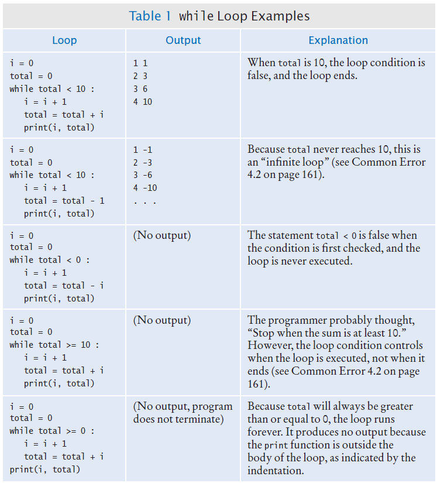

## 4.2 Problem Solving: Hand-Tracing

**Why learn hand-tracing?** Hand-tracing means simulating a program on paper, step by step, by writing down how key variables change. It helps you understand exactly how a loop runs (which values the variables take each time), find logic errors (e.g., off-by-one or wrong conditions) without running the code, and predict the output. When a program does not behave as expected, hand-tracing the loop is a reliable way to see where the logic goes wrong.

### Hand-Tracing Loops

**Example:** Calculate the sum of digits of a number (1729 → 1+7+2+9)

**Steps:**
1. Make columns for key variables (n, total, digit)
2. Examine the code and number the steps
3. Set variables to state before loop begins

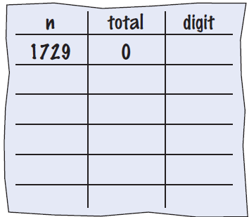

### Tracing Sum of Digits

- Start executing loop body statements, changing variable values on a new line
- Cross out values in previous line

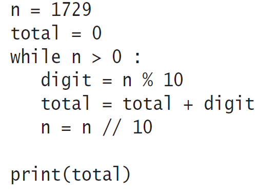


- Continue executing loop statements, changing variables
- 1729 / 10 leaves 172 (no remainder)

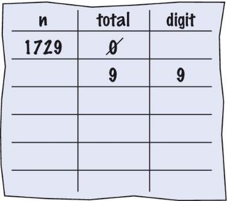

### Tracing Sum of Digits (Continued)

Test condition. If `True`, execute loop again.

Variable `n` is 172. Is 172 > 0? `True`!

Make a new line for the second time through and update variables.

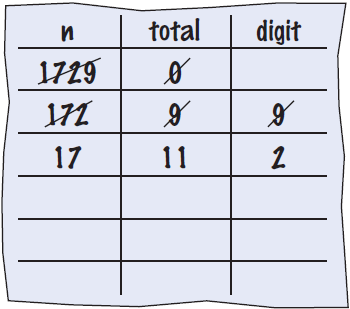

Third time through:

Variable `n` is 17, which is still greater than 0.

Execute loop statements and update variables.

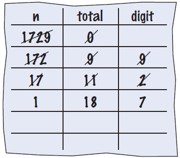

Fourth loop iteration:

Variable `n` is 1 at start of loop. 1 > 0? `True`

Executes loop and changes variable `n` to 0 (1/10 = 0)

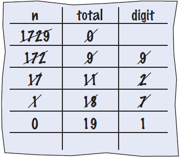

### Tracing Sum of Digits (Final)

Because `n` is 0, the expression `(n > 0)` is `False`.

Loop body is not executed.

Jumps to next statement after the loop body.

Finally prints the sum!

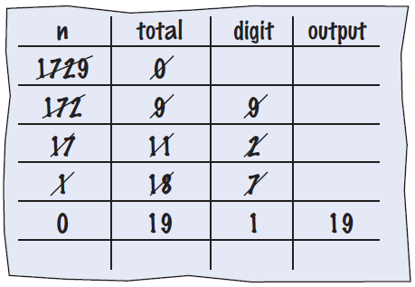

### Summary of the `while` Loop

- `while` loops are very common
- Initialize variables before you test
- The condition is tested **BEFORE** the loop body (this is called **pre-test**)
- The condition often uses a counter variable
- Something inside the loop should change one of the variables used in the test
- Watch out for infinite loops!

## 4.3 Application: Processing Sentinel Values

### Processing Sentinel Values

**Sentinel values** are often used when you don't know how many items are in a list. Use a 'special' character or value to signal the "last" item.

For numeric input of positive numbers, it is common to use the value `-1`.

A sentinel value denotes the end of a data set, but it is **not part of the data**.

```python
salary = 0.0

while salary >= 0:
    salary = float(input())
    if salary >= 0.0:
        total = total + salary
        count = count + 1
```

### Averaging a Set of Values

**Algorithm:**
1. Declare and initialize a `total` variable to 0
2. Declare and initialize a `count` variable to 0
3. Declare and initialize a `salary` variable to 0
4. Prompt user with instructions
5. Loop until sentinel value is entered
6. Save entered value to input variable (`salary`)
7. If salary is not -1 or less (sentinel value):
   - Add salary variable to total variable
   - Add 1 to count variable
8. Make sure you have at least one entry before you divide!
9. Divide total by count and output
10. Done!

### sentinel.py Example

```python
##
#  This program prints the average of salary values that are terminated with
#  a sentinel.
#

# Initialize variables to maintain the running total and count.
total = 0.0
count = 0

# Initialize salary to any non-sentinel value.
salary = 0.0

# Process data until the sentinel is entered.
while salary >= 0.0 :
   salary = float(input("Enter a salary or -1 to finish: "))
   if salary >= 0.0 :
      total = total + salary
      count = count + 1

# Compute and print the average salary.
if count > 0 :
   average = total / count
   print("Average salary is", average)
else :
   print("No data was entered.")
```

**Key points:**
- Outside the `while` loop: declare and initialize variables to use
- Input new `salary` and compare to sentinel
- Update running `total` and `count` (to calculate the average later)
- Since `salary` is initialized to 0, the `while` loop statements will execute at least once

**Key points:**
- Prevent divide by 0
- Calculate and output the average salary using the `total` and `count` variables

### Sentinel Example

**Instructions:**
1. Open the file: `sentinel.py`
2. Notice the use of the `if` test inside the `while` loop
3. The `if` checks to make sure we are not processing the sentinel value

### Priming Read

Some programmers don't like the "trick" of initializing the input variable with a value other than a sentinel.

```python
# Set salary to a value to ensure that the loop
# executes at least once.
salary = 0.0

while salary >= 0:
    salary = float(input("Enter a salary or -1 to finish: "))
```

### Modification Read

An alternative is to change the variable with a read before the loop.

The input operation at the bottom of the loop is used to obtain the next input.

```python
# Priming read
salary = float(input("Enter a salary or -1 to finish: "))

while salary >= 0.0:
    total = total + salary
    count = count + 1
    
    # Modification read
    salary = float(input("Enter a salary or -1 to finish: "))
```

### Boolean Variables and Sentinels

A boolean variable can be used to control a loop. Sometimes called a **flag** variable.

```python
done = False

while not done:
    value = float(input("Enter a salary or -1 to finish: "))
    
    if value < 0.0:
        done = True
    else:
        # Process value
        total = total + value
        count = count + 1
```

**Key points:**
- Initialize `done` so that the loop will execute
- Set `done` flag to `True` if sentinel value is found

## 4.4 Common Loop Algorithms

### Common Loop Algorithms

- Sum and Average Value
- Counting Matches
- Prompting until a Match Is Found
- Maximum and Minimum

### Average Example

```python
total = 0.0
count = 0

inputStr = input("Enter value: ")

while inputStr != "":
    value = float(inputStr)
    total = total + value
    count = count + 1
    inputStr = input("Enter value: ")

if count > 0:
    average = total / count
else:
    average = 0.0
```

**Average of Values:**
- First total the values
- Initialize `count` to 0
- Increment per input
- Check for `count` 0 before divide!

### Sum Example

**Sum of Values:**
- Initialize total to 0
- Use `while` loop with sentinel

```python
total = 0.0

inputStr = input("Enter value: ")

while inputStr != "":
    value = float(inputStr)
    total = total + value
    inputStr = input("Enter value: ")
```

### Counting Matches (e.g., Negative Numbers)

```python
negatives = 0

inputStr = input("Enter value: ")

while inputStr != "":
    value = int(inputStr)
    
    if value < 0:
        negatives = negatives + 1
    
    inputStr = input("Enter value: ")

print("There were", negatives, "negative values.")
```

**Counting Matches:**
- Initialize `negatives` to 0
- Use a `while` loop
- Add to `negatives` per match

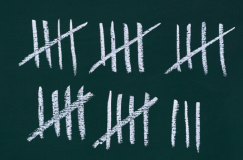

### Prompt Until a Match is Found

**Algorithm:**
1. Initialize boolean flag to `False`
2. Test sentinel in `while` loop
3. Get input, and compare to range
4. If input is in range, change flag to `True`
5. Loop will stop executing

```python
valid = False

while not valid:
    value = int(input("Please enter a positive value < 100: "))
    
    if value > 0 and value < 100:
        valid = True
    else:
        print("Invalid input.")
```

> **Note:** This is an excellent way to validate user-provided inputs.

### Maximum

**Algorithm:**
1. Get first input value
2. By definition, this is the largest that you have seen so far
3. Loop while you have a valid number (non-sentinel)
4. Get another input value
5. Compare new input to largest (or smallest)
6. Update largest if necessary

```python
largest = int(input("Enter a value: "))

inputStr = input("Enter a value: ")

while inputStr != "":
    value = int(inputStr)
    
    if value > largest:
        largest = value
    
    inputStr = input("Enter a value: ")
```

### Minimum

**Algorithm:**
1. Get first input value
2. This is the smallest that you have seen so far!
3. Loop while you have a valid number (non-sentinel)
4. Get another input value
5. Compare new input to largest (or smallest)
6. Update smallest if necessary

```python
smallest = int(input("Enter a value: "))

inputStr = input("Enter a value: ")

while inputStr != "":
    value = int(inputStr)
    
    if value < smallest:
        smallest = value
    
    inputStr = input("Enter a value: ")
```

### Grades Example

**Instructions:**
1. Open the file: `grades.py`
2. Look carefully at the source code
3. The maximum possible score is read as user input
4. There is a loop to validate the input
5. The passing grade is computed as 60% of the available points

## 4.5 The `for` Loop

### What is a `for` Loop?

**Uses of a `for` loop:**
- The `for` loop can be used to iterate over the contents of any **container**
- A **container** is an object (like a **string**) that contains or stores a collection of elements
- A **string** is a container that stores the collection of characters in the string

### An Example of a `for` Loop

**While version:**

```python
stateName = "Virginia"
i = 0
while i < len(stateName) :
   letter = stateName[i]
   print(letter)
   i = i + 1
```

**For version:**

```python
stateName = "Virginia"
for letter in stateName :
   print(letter)
```

**Important difference between the `while` loop and the `for` loop:**
- In the `while` loop, the **index variable** `i` is assigned 0, 1, and so on
- In the `for` loop, the **element variable** is assigned `stateName[0]`, `stateName[1]`, and so on

### The `for` Loop (Count-Controlled)

**Uses of a `for` loop:**
- A `for` loop can also be used as a count-controlled loop that iterates over a range of integer values

```python
# while version
i = 1
while i < 10:
    print(i)
    i = i + 1

# for version
for i in range(1, 10):
    print(i)
```

### Syntax of a `for` Statement (Container)

Using a `for` loop to iterate over the contents of a container, an element at a time.

")

### Syntax of a `for` Statement (Range)

You can use a `for` loop as a count-controlled loop to iterate over a range of integer values.

We use the `range` function for generating a sequence of integers that are less than the argument that can be used with the `for` loop.

")

### Good Examples of `for` Loops

Keep the loops simple!

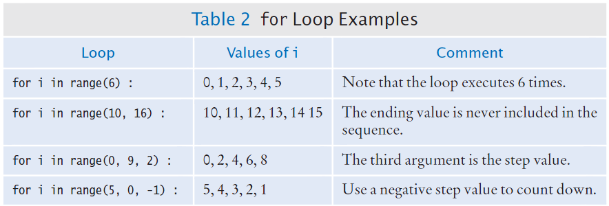

### Investment Example

```python
##
#  This program prints a table showing the growth of an investment.
#

# Define constant variables.
RATE = 5.0
INITIAL_BALANCE = 10000.0

# Obtain the number of years for the computation.
numYears = int(input("Enter number of years: "))

# Print the table of balances for each year.
balance = INITIAL_BALANCE
for year in range(1, numYears + 1) :
   interest = balance * RATE / 100
   balance = balance + interest
   print("%4d %10.2f" % (year, balance))
```

### Programming Tip: Asymmetric Bounds

Finding the correct lower and upper bounds for a loop can be confusing. Should you start at 0 or at 1? Should you use `<= b` or `< b`?

**Why “asymmetric”?** In `range(a, b)`, the two bounds are **not treated the same**: the first value **a** is **included** (you start at a), but the second value **b** is **excluded** (you stop before reaching b). So **a** means “first value in,” and **b** means “first value out.” That difference is why we call the bounds **asymmetric**.

**Example:** `range(1, 4)` produces 1, 2, 3 — three values. The 4 is never used; it only marks where to stop. So the number of iterations is **b − a** (here, 4 − 1 = 3).

**Counting is easier** with asymmetric bounds because the number of iterations is always **b − a**, with no “+1” to remember.

```python
# while version: i takes values a, a+1, ..., b-1 (stops when i reaches b)
i = a
while i < b:
    # ...
    i = i + 1

# for version: same idea — range(a, b) gives a through b-1
for i in range(a, b):
    # ...
```

Both loops run **b − a** times.

### Programming Tip: Symmetric Bounds

**Why “symmetric”?** When you write a condition like **a ≤ i ≤ b**, both **a** and **b** are treated the same: **both are included**. The range is “from a to b inclusive,” so the bounds are **symmetric**.

**Example:** “Years 1 through 5” means 1, 2, 3, 4, 5 — five values. So the number of iterations is **b − a + 1** (here, 5 − 1 + 1 = 5). That extra **+1** is easy to forget and is a common source of off-by-one errors.

```python
# while version: i takes values a, a+1, ..., b (b is included)
i = a
while i <= b:
    # ...
    i = i + 1

# for version: range(a, b) excludes b, so we must use b+1 to include b
# "Years 1 through numYears" → range(1, numYears + 1)
for year in range(1, numYears + 1):
    # ...
```

This loop runs **b − a + 1** times.

**Quick comparison:**

| Style        | Condition / range      | a included? | b included? | Number of iterations |
|-------------|-------------------------|-------------|-------------|-----------------------|
| Asymmetric  | `i < b` / `range(a, b)` | Yes         | No          | b − a                 |
| Symmetric   | `i <= b` / need `range(a, b+1)` | Yes   | Yes         | b − a + 1             |

### Summary of the `for` Loop

- `for` loops are very powerful
- The `for` loop can be used to iterate over the contents of any container, which is an object that contains or stores a collection of elements
- A string is a container that stores the collection of characters in the string
- A `for` loop can also be used as a count-controlled loop that iterates over a range of integer values

### Steps to Writing a Loop

**Planning:**
1. Decide what work to do inside the loop
2. Specify the loop condition
3. Determine loop type
4. Setup variables before the first loop
5. Process results when the loop is finished
6. Trace the loop with typical examples

**Coding:**
1. Implement the loop in Python

### A Special Form of the `print` Function

Python provides a special form of the `print` function that does not start a new line after the arguments are displayed.

This is used when we want to print items on the same line using multiple `print` statements.

**Example:**
```python
print("00", end="")
print(3 + 4)
```

**Output:**
```
007
```

Including `end=""` as the last argument to the `print` function prints an empty string after the arguments, instead of a new line.

The output of the next `print` function starts on the same line.

## 4.6 Nested Loops

### Loops Inside of Loops

In Chapter Three we learned how to nest `if` statements to allow us to make complex decisions.

Remember that to nest the `if` statements we need to indent the code block.

Complex problems sometimes require a **nested loop**, one loop nested inside another loop.

The nested loop will be indented inside the code block of the first loop.

A good example of using nested loops is when you are processing cells in a table:
- The outer loop iterates over all of the rows in the table
- The inner loop processes the columns in the current row

### Our Example Problem Statement

Print a **10 by 10 multiplication table**: rows and columns from 1 to 10, with each cell showing the product of its row and column.

**Key idea:** Use an outer loop for the rows (1 to 10) and an inner loop for the columns (1 to 10). For each cell, print `row * column`.

```python
##
#  This program prints a 10 by 10 multiplication table.
#

for row in range(1, 11):
    for col in range(1, 11):
        print(row * col, end="\t")
    print()
```

- The **outer loop** runs once per row (`row` = 1, 2, …, 10).
- The **inner loop** runs once per column in that row (`col` = 1, 2, …, 10).
- `print(row * col, end="\t")` prints each product followed by a tab; `print()` with no arguments starts a new line after each row.

**Sample output (first few rows):**

```
1	2	3	4	5	6	7	8	9	10
2	4	6	8	10	12	14	16	18	20
3	6	9	12	15	18	21	24	27	30
...
```

## 4.7 Processing Strings

### Processing Strings

A common use of loops is to process or evaluate strings.

For example, you may need to count the number of occurrences of one or more characters in a string or verify that the contents of a string meet certain criteria.

### String Processing Examples

- Counting Matches
- Finding All Matches
- Finding the First or Last Match
- Validating a String
- Building a New String

### Counting Matches

Suppose you need to count the number of uppercase letters contained in a string.

We can use a `for` loop to check each character in the string to see if it is uppercase.

The loop below sets the variable `char` equal to each successive character in the string.

Each pass through the loop tests the next character in the string to see if it is uppercase.

```python
uppercase = 0

for char in string:
    if char.isupper():
        uppercase = uppercase + 1
```

### Counting Vowels

Suppose you need to count the vowels within a string.

We can use a `for` loop to check each character in the string to see if it is in the string of vowels "aeiou".

The loop below sets the variable `char` equal to each successive character in the string.

Each pass through the loop tests the lowercase of the next character in the string to see if it is in the string "aeiou".

```python
vowels = 0

for char in word:
    if char.lower() in "aeiou":
        vowels = vowels + 1
```

### Finding All Matches Example

When you need to examine every character in a string, independent of its position, we can use a `for` statement to examine each character.

If we need to print the position of each uppercase letter in a sentence, we can test each character in the string and print the position of all uppercase characters.

We set the range to be the length of the string.

We test each character. If it is uppercase, we print `i`, its position in the string.

```python
sentence = input("Enter a sentence: ")

for i in range(len(sentence)):
    if sentence[i].isupper():
        print(i)
```

### Finding the First Match

This example finds the position of the first digit in a string.

```python
found = False
position = 0

while not found and position < len(string):
    if string[position].isdigit():
        found = True
    else:
        position = position + 1

if found:
    print("First digit occurs at position", position)
else:
    print("The string does not contain a digit.")
```

### Finding the Last Match

Here is a loop that finds the position of the last digit in the string.

This approach uses a `while` loop to start at the last character in a string and test each value moving from the end of the string to the start of the string.

Position is set to the length of the string - 1.

If the character is not a digit, we decrease position by 1.

Until we find a digit, or process all the characters.

```python
found = False
position = len(string) - 1

while not found and position >= 0:
    if string[position].isdigit():
        found = True
    else:
        position = position - 1
```

---

## Key Takeaways

1. **Loops** allow programs to execute instructions repeatedly while a condition is `True`
2. **`while` loops** are general-purpose loops that test a condition before each iteration
3. **`for` loops** can iterate over containers (like strings) or ranges of integers
4. **Sentinel values** signal the end of data input when the number of items is unknown
5. **Common loop algorithms** include summing, averaging, counting matches, and finding maximum/minimum values
6. **Nested loops** allow processing of two-dimensional data structures like tables
7. **String processing** with loops enables character-by-character analysis and validation
8. **Hand-tracing** helps understand loop execution and debug logic errors
9. **Common errors** include infinite loops, off-by-one errors, and incorrect test conditions

---

*End of Chapter Four*

[← Back to Course Index](../table-of-contents.md)
