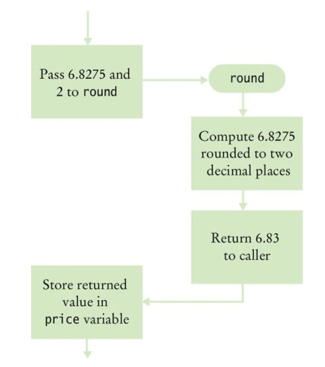
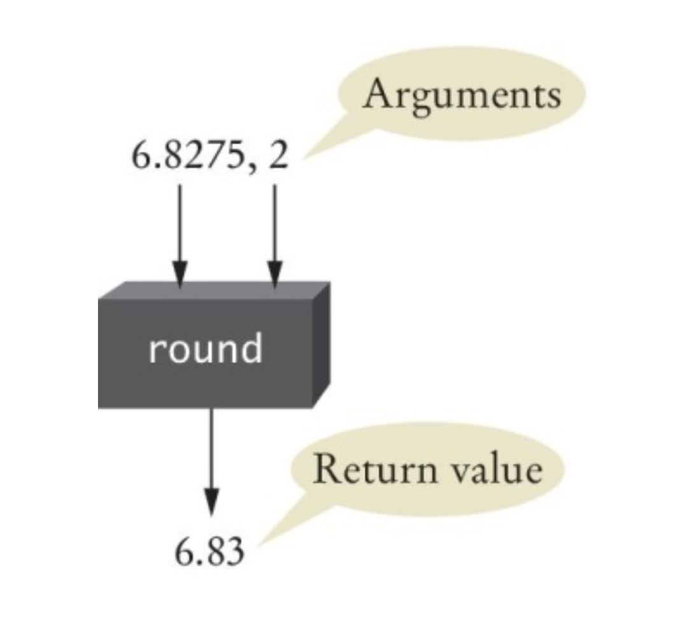
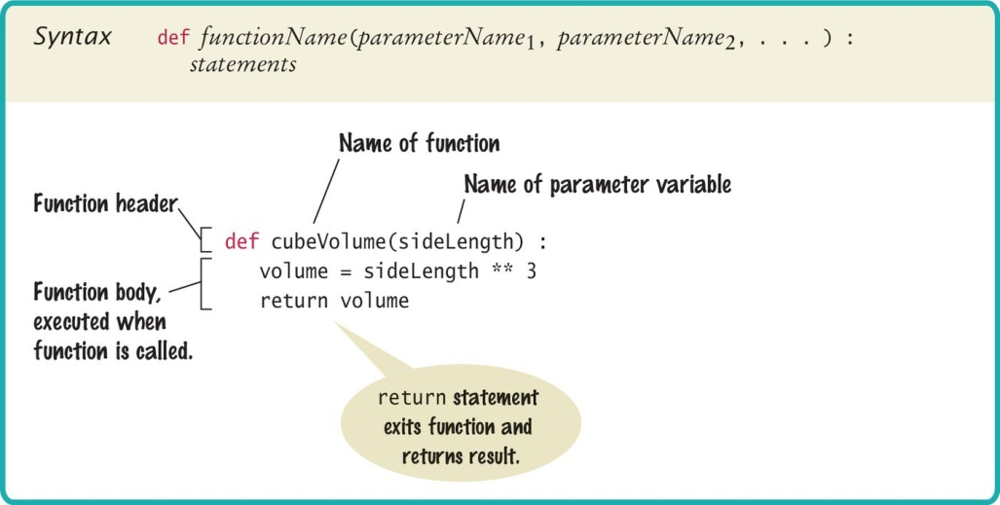
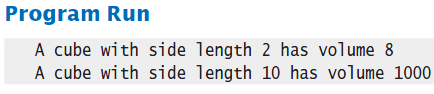
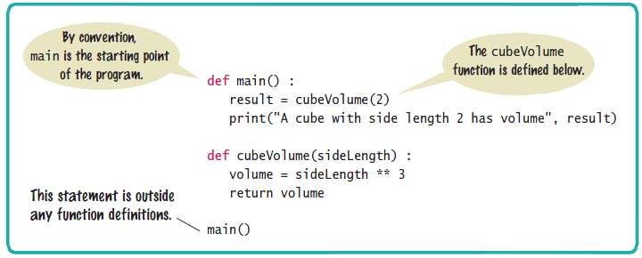
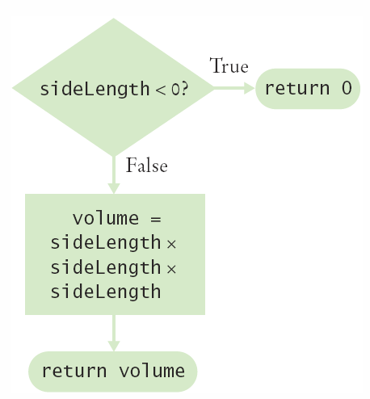
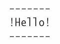

# Chapter Five: Functions

---

## Introduction

In this chapter, you will learn how to design and implement your own functions. Using the process of stepwise refinement, you will be able to break up complex tasks into sets of cooperating functions.

---

## Chapter Goals

In this chapter you will learn:

- To implement functions
- To become familiar with the concept of parameter passing
- To develop strategies for decomposing complex tasks into simpler ones
- To be able to determine the scope of a variable

---

[← Back to Course Index](../table-of-contents.md)

## 5.1 Functions as Black Boxes

A **function** is a sequence of instructions with a name. For example, the `round` function, which was introduced in Chapter 2, contains instructions to round a floating-point value to a specified number of decimal places.


## Calling Functions

You **call** a function in order to execute its instructions. For example, by using the expression `round(6.8275, 2)`, your program calls the `round` function and asks it to round 6.8275 to two decimal digits:

```python
price = round(6.8275, 2)  # Sets result to 6.83
```

When the function finishes, it **returns** its result back to the place where it was called, and your program resumes execution.




## Function Arguments

When you call a function, you pass it *inputs*—the values it needs to do its job. In the call `round(6.8275, 2)`, the values `6.8275` and `2` are the **arguments** of the function call. Note that arguments are not necessarily input from a human user; they are simply the values for which we want the function to compute a result. Functions can receive multiple arguments, or they may have no arguments at all.


## Function Return Values

The *output* that a function computes is called its **return value**. A function returns at most one value, and that value is sent back to the point in your program where the function was called. For example:

```python
price = round(6.8275, 2)
```

When `round` returns, its result is stored in the variable `price`. Do not confuse *returning* a value with *printing* output: `return` sends a value back to the caller; `print()` displays text to the user.


## Black Box Analogy

Think of a thermostat: you set a desired temperature and it turns the heater or A/C on as needed. You don't have to know how it measures the current temp or what signals it sends—you just give it what it needs and get the result. **Use functions the same way:** treat them as black boxes. Pass in what the function needs (its arguments), and receive the answer (its return value).

## The round Function as a Black Box

When you call `round(6.8275, 2)`, you pass the necessary arguments and get back the result (6.83). As a user of the function, you don't need to know how it is implemented; you only need to know its **specification**: if you provide arguments `x` and `n`, the function returns `x` rounded to `n` decimal digits.




## Designing Your Own Functions

When you design your own functions, make them behave like black boxes: clear inputs, clear output, and no need for the caller to know the internals. Even if you are the only person on the project, this habit keeps the program easier to understand and maintain.


## 5.2 Implementing and Testing Functions

Suppose we want a function that computes the volume of a cube. To define it we need to decide: what does it need (one number, the side length) and what does it return (the volume). When writing the function:

1. **Pick a name** for the function (e.g. `cubeVolume`).
2. **Declare a variable** for each value the function receives (e.g. `sideLength`). These are called **parameter variables**.
3. **Put this together** with the `def` keyword to form the first line—the **header** of the function:

   ```python
   def cubeVolume(sideLength):
   ```

### Testing a Function

If you run a program that only defines a function and does not call it, nothing visible happens—the function is never executed. To test a function, your program should contain both the function definition and statements that call the function and print (or use) the result.


## Calling/Testing the Cube Function

```python
def cubeVolume(sideLength):
    volume = sideLength ** 3
    return volume

result1 = cubeVolume(2)
result2 = cubeVolume(10)
print("A cube with side length 2 has volume", result1)
print("A cube with side length 10 has volume", result2)
```

- The first block is the **function definition** (implementing the function).
- The last three lines **call** the function and print the results (testing).


## Syntax: Function Definition




## Programming Tip: Function Comments

Whenever you write a function, add a short comment (or docstring) that describes what it does, what its parameters mean, and what it returns. Comments are for human readers, not the compiler—they make the code easier to understand and maintain.

**Example:** A documented function. The comments (or docstring) explain the purpose, the parameters, and the return value:

```python
## Computes the volume of a cube.
#  @param sideLength the length of a side of the cube
#  @return the volume of the cube
#
def cubeVolume(sideLength):
    volume = sideLength ** 3
    return volume
```


## Cubes.py with Documentation

```python
##
#  This program computes the volumes of two cubes.
#

def main():
    result1 = cubeVolume(2)
    result2 = cubeVolume(10)
    print("A cube with side length 2 has volume", result1)
    print("A cube with side length 10 has volume", result2)

## Computes the volume of a cube.
#  @param sideLength the length of a side of the cube
#  @return the volume of the cube
#
def cubeVolume(sideLength):
    volume = sideLength ** 3
    return volume

# Start the program.
main()
```




## The main Function

When you structure a program with functions, it is good practice to put the main logic inside a function and treat that as the **starting point**. Any legal name is allowed for that function; we use `main` because it is the conventional name in many languages. You must have at least one statement in the program that **calls** this function (e.g. `main()`) so that execution actually starts there.


## Syntax: The main Function




## Using Functions: Order

In Python, a function must be **defined before it is called** at the top level. For example, the following will produce an error:

```python
print(cubeVolume(10))

def cubeVolume(sideLength):
    volume = sideLength ** 3
    return volume
```

Python does not know that `cubeVolume` will be defined later, so the call fails.

If the call is *inside* another function (e.g. inside `main`), the callee can be defined later in the file. When `main()` runs, Python has already seen the definition of `cubeVolume`. So the following is valid:

```python
def main():
    result = cubeVolume(2)
    print("A cube with side length 2 has volume", result)

def cubeVolume(sideLength):
    volume = sideLength ** 3
    return volume

main()
```


## 5.3 Parameter Passing

When you **call** a function, you pass **arguments**. The function receives those values in its **parameters**. Parameter passing is how the values get from the caller into the function.

### Arguments and parameters

- **Argument** — The value you pass in the function call (e.g. `cubeVolume(2)` or `cubeVolume(side)`). It can be a literal like `2` or the value of a variable.
- **Parameter** — The variable declared in the function definition (e.g. `sideLength` in `def cubeVolume(sideLength):`). It is initialized with the argument value when the function is called and used like any other variable inside the function.

So in `result1 = cubeVolume(2)`, the argument is `2`. Inside `cubeVolume`, the parameter `sideLength` is set to `2` for that call.

### How it works (pass by value)

Python passes the **value** of the argument into the parameter. For numbers and other simple types, the function gets a copy of the value. So when the function runs, the parameter variable holds that value and can be used in expressions—but changing the parameter variable does not change the variable in the caller.

**Example:** Steps when `result1 = cubeVolume(2)` is executed:

1. The argument `2` is evaluated.
2. `cubeVolume` is called and its parameter `sideLength` is set to `2`.
3. The function body runs (e.g. `volume = sideLength ** 3` → 8).
4. The return value is sent back and assigned to `result1`.

```python
result1 = cubeVolume(2)

def cubeVolume(sideLength):
    volume = sideLength ** 3
    return volume
```


### ⚠️ Common Error: Modifying parameter variables

Because the parameter holds a copy of the value (for numbers), the caller’s variables are not changed when you assign to the parameter. But **assigning to a parameter inside the function is confusing**—readers expect parameters to be “inputs” that are not reassigned. Avoid modifying parameter variables; use a local variable instead.

**Confusing (modifies parameter):**

```python
def totalCents(dollars, cents):
    cents = dollars * 100 + cents   # Modifies parameter variable
    return cents
```

**Clear (use a separate variable):**

```python
def totalCents(dollars, cents):
    result = dollars * 100 + cents
    return result
```

## 5.4 Return Values

Functions can optionally **return** one value to the caller. You use a `return` statement to send that value back. A `return` statement does two things: it immediately **terminates** the function, and it **passes** the return value back to the place where the function was called. The return value can be a literal, a variable, or any expression (e.g. a calculation).

```python
def cubeVolume(sideLength):
    volume = sideLength ** 3
    return volume
```

## Multiple return Statements



A function can have more than one `return` statement (for example, one per branch of an `if`). The important rule: **every path** through the function that should produce a result must hit a `return` statement.


```python
def cubeVolume(sideLength):
    if sideLength < 0:
        return 0
    return sideLength ** 3
```

**Alternative:** Instead of multiple `return` statements, you can compute the result into a variable and have a single `return` at the end of the function. For example:

```python
def cubeVolume(sideLength):
    if sideLength >= 0:
        volume = sideLength ** 3
    else:
        volume = 0
    return volume
```

## Make Sure A Return Catches All Cases

If some path through the function does not execute a `return` statement, the function still returns—Python returns the special value `None`. That can cause confusing bugs (e.g. when the caller expects a number). So make sure **every logical branch** that should produce a value has a `return`. For example, if `sideLength` could be negative, zero, or positive, each case should be handled and return an appropriate value. The compiler does not warn you when a branch is missing a `return`.

```python
def cubeVolume(sideLength):
    if sideLength >= 0:
        return sideLength ** 3
    # Error — no return value if sideLength < 0
```

A correct implementation:

```python
def cubeVolume(sideLength):
    if sideLength >= 0:
        return sideLength ** 3
    else:
        return 0
```

## Pyramids.py

In the file `pyramids.py`, the `main` function calls `pyramidVolume` with different arguments and prints the results so you can check them against the expected values.

```python
##
#  This program defines a function for calculating a pyramid's volume and
#  provides a unit test for the function.
#

def main():
    print("Volume:", pyramidVolume(9, 10))
    print("Expected: 300")
    print("Volume:", pyramidVolume(0, 10))
    print("Expected: 0")

## Computes the volume of a pyramid whose base is a square.
#  @param height a float indicating the height of the pyramid
#  @param baseLength a float indicating the length of one side of
#  the pyramid's base
#  @return the volume of the pyramid as a float
#
def pyramidVolume(height, baseLength):
    baseArea = baseLength * baseLength
    return height * baseArea / 3

# Start the program.
main()
```

## 5.5 Functions Without Return Values

A function does not have to return a value. If it only needs to do something (e.g. print output or change state), you can omit the `return` statement or use `return` with no value. The function can still produce output with `print()` or other side effects.

```python
def boxString(contents):
    n = len(contents)
    print("-" * (n + 2))
    print("!" + contents + "!")
    print("-" * (n + 2))
```


```python
boxString("Hello")
```

## Using return Without a Value

You can use `return` with no value (just `return`). That **ends the function immediately** and returns `None` to the caller. This is useful to exit early when a condition is met (e.g. invalid input) without returning a result.

```python
def boxString(contents):
    n = len(contents)
    if n == 0:
        return  # Return immediately
    print("-" * (n + 2))
    print("!" + contents + "!")
    print("-" * (n + 2))
```

## 5.6 Variable Scope

The **scope** of a variable is the part of the program in which that variable is visible and can be used.

### Where variables can be declared

- **Inside a function** — These are **local variables** (including parameter variables). They are only available inside that function and are not visible to other functions.
- **Outside all functions** — These are **global variables**. They are in *global scope* and can be used (and changed) by code in any function that declares `global name` for that name.

### Local variables

Variables declared inside one function are not visible to other functions. In the following example, `sideLength` is local to `main`. Using it inside `cubeVolume` would be an error because `cubeVolume` has no access to `main`'s locals—and here `cubeVolume()` takes no parameters, so `sideLength` is undefined there.

```python
def main():
    sideLength = 10
    result = cubeVolume()   # cubeVolume has no parameters
    print(result)

def cubeVolume():
    return sideLength * sideLength * sideLength   # ERROR: sideLength not defined here
```

### Reusing names in different functions

You can use the same variable name in different functions. Each function has its own local variables, so `result` in one function and `result` in another are two different variables. Their scopes do not overlap.

### Global variables

Global variables are defined at the top level of the file (outside any function). A global variable is visible to all functions defined after it in the file. Any function that wants to **assign** to a global variable must include a `global` declaration for that name; otherwise the name is treated as a new local variable.

**Example:**

```python
balance = 10000    # Global variable

def withdraw(amount):
    global balance
    if balance >= amount:
        balance = balance - amount
```

If you omit `global balance`, then `balance` inside `withdraw` would be treated as a local variable, and the assignment would not change the global `balance`.

### Programming tip: Prefer parameters and return values

There are a few cases where globals are reasonable (e.g. constants like `pi` in the `math` module), but they are rare. Programs that rely on global variables are harder to maintain and extend, because you can no longer treat each function as a *black box* that gets inputs via parameters and sends back a result via `return`. Prefer passing data in with parameters and returning results; use globals only when necessary.

## 5.7 Exception Handling (brief overview)

Code that talks to the outside world—for example an **API call**—can fail (network error, bad response, timeout). If you don’t handle that, the program can crash. Use **try/except** so that when an error occurs, your code catches it and does something sensible (e.g. log the error, print a message, or return a default) instead of stopping.

Put the risky code in a `try` block. If an exception happens there, execution jumps to the matching `except` block. You can catch a specific exception type (e.g. `requests.RequestException` for many HTTP errors) or use a broad `except Exception` to catch any error.

**Example: handling errors around an API call**

```python
import requests

try:
    response = requests.get("https://gradesapi.org/v2/everything", params={"class": "python", "pageSize": 10}, timeout=5)
    response.raise_for_status()   # raise an error if HTTP status is 4xx or 5xx
    data = response.json()
    # ... use data ...
except requests.RequestException as e:
    print("API request failed:", e)
```

If the request fails (connection error, timeout, or bad status), the exception is caught and the message is printed; your program can continue or exit cleanly instead of crashing. You’ll see more on exceptions in a later section.

---

## Key Takeaways

1. **Functions** are named sequences of instructions; they receive **arguments** and can **return** a value.
2. **Parameter passing** supplies the values for a function’s parameters; avoid modifying parameter variables.
3. **Return values** are sent back with the `return` statement; every code path that should produce a value must return.
4. **Functions without return values** can still use `return` to exit early, or omit it to fall off the end.
5. **Stepwise refinement** breaks complex tasks into smaller functions that are easier to implement and test.
6. **Variable scope** is the part of the program where a variable is visible; local and parameter variables are confined to their function.
7. **Exception handling** with `try`/`except` lets you catch errors (e.g. from API calls) so your program doesn’t crash.

---

*End of Chapter Five*

[← Back to Course Index](../table-of-contents.md)
