# Chapter 6: Lists

---

## Introduction

This chapter introduces Python lists: ordered, mutable collections that can hold multiple items. You will learn how to create and traverse lists, apply common algorithms, use lists with functions, and work with two-dimensional tables.

---

## Chapter Goals

In this chapter you will learn:

- To collect elements using lists
- To use the `for` loop for traversing lists
- To learn common algorithms for processing lists
- To use lists with functions
- To work with tables of data

---

[← Back to Course Index](../table-of-contents.md)

## Contents

- Basic Properties of Lists
- List Operations
- Common List Algorithms
- Using Lists with Functions
- Tables

---

## 6.1 Basic Properties of Lists

### Python Lists

A **Python list** is an ordered, mutable collection that can hold multiple items of different data types. Lists are one of the most commonly used data structures in Python.

**Key features of lists:**

- **Ordered:** Elements maintain their insertion order.
- **Mutable:** You can modify lists by adding, removing, or changing elements.
- **Heterogeneous:** Can store different data types (e.g., integers, strings, other lists).
- **Dynamic:** Lists can grow or shrink as needed.

### Creating a List

Specify a list using square brackets `[]`:

```python
values = [32, 54, 67.5, 29, 35, 80, 115, 44.5, 100, 65]
```

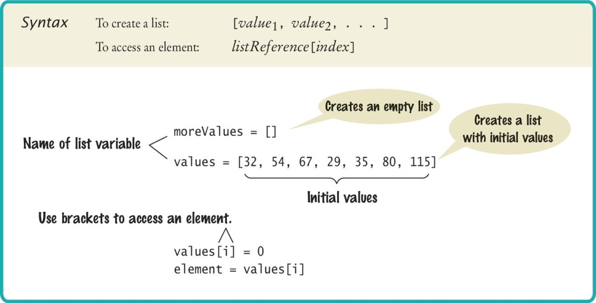

### Accessing List Elements

A list is a sequence of **elements**, each of which has an integer position or **index**. To access a list element, use the subscript operator `[]`, just as with individual characters in a string:

```python
print(values[5])   # Accessing a list element
values[5] = 87     # Replacing a list element
```

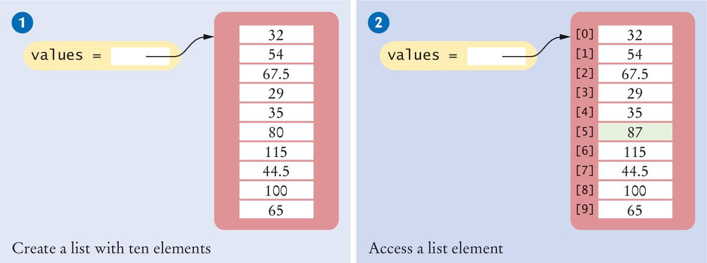

### Lists vs. Strings

Both lists and strings are **sequences**, and the `[]` operator is used to access an element in any sequence. Two important differences:

1. **Content:** Lists can hold values of any type; strings are sequences of characters.
2. **Mutability:** Strings are **immutable**—you cannot change the characters in the sequence. Lists are **mutable**.

### Out-of-Range Errors

A common error is accessing a nonexistent element. If your program uses an out-of-range index, Python raises an exception at runtime:

```python
values = [2.3, 4.5, 7.2, 1.0, 12.2, 9.0, 15.2, 0.5]
values[8] = 5.4   # Error: values has 8 elements, indices 0 to 7
```

### Determining List Length

Use the **`len()`** function to get the number of elements in a list:

```python
numElements = len(values)
```

### Loop Over the Index Values

To process each element by index, use `range(len(values))` so the code adapts if the list size changes:

```python
# Using list index
for i in range(len(values)):
    print(i, values[i])

# Without index (traverse list elements directly)
for element in values:
    print(element)
```

### List References

A list variable holds a **reference** to the list contents (the location in memory), not the elements themselves.

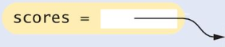
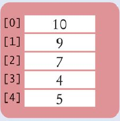

### List Aliases

When you assign a list variable to another, both variables refer to the **same** list. The second variable is an **alias** for the first.

```python
scores = [10, 9, 7, 4, 5]
values = scores   # Copying list reference; both point to same list
```

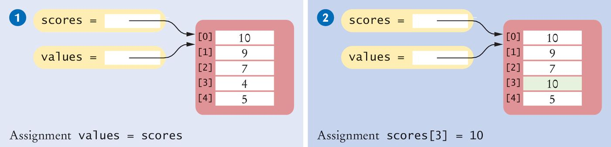

### Modifying Aliased Lists

You can modify the list through either variable:

```python
scores[3] = 10
print(values[3])   # Prints 10
```

### Copying Lists

List variables hold a reference, not the elements. Assigning `prices = values` gives another reference to the same list. To create a **new list** with the same elements, use **`list()`**:

```python
prices = list(values)   # New list with same elements
```

")

### Reverse Subscripts

Python supports **negative indices** to access elements from the end: `-1` is the last element, `-2` the second-to-last, and so on.

```python
last = values[-1]
print("The last element in the list is", last)
```

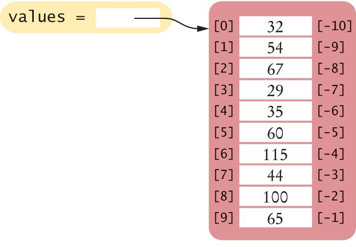

---

## 6.2 List Operations

### Overview

Common list operations include:

- Appending and inserting elements
- Finding and removing elements
- Concatenation and replication
- Equality testing
- Sum, maximum, minimum, and sorting
- Slicing

### Appending Elements

Create an empty list and add elements with **`append()`**:

```python
friends = []
friends.append("Harry")
friends.append("Emily")
friends.append("Bob")
friends.append("Cari")
```

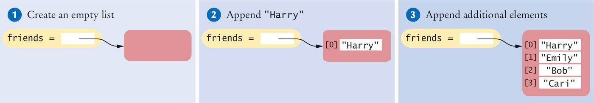

### Inserting an Element

Use **`insert(index, value)`** to add an element at a specific position:

```python
friends = ["Harry", "Emily", "Bob", "Cari"]
friends.insert(1, "Cindy")   # Insert at index 1
```

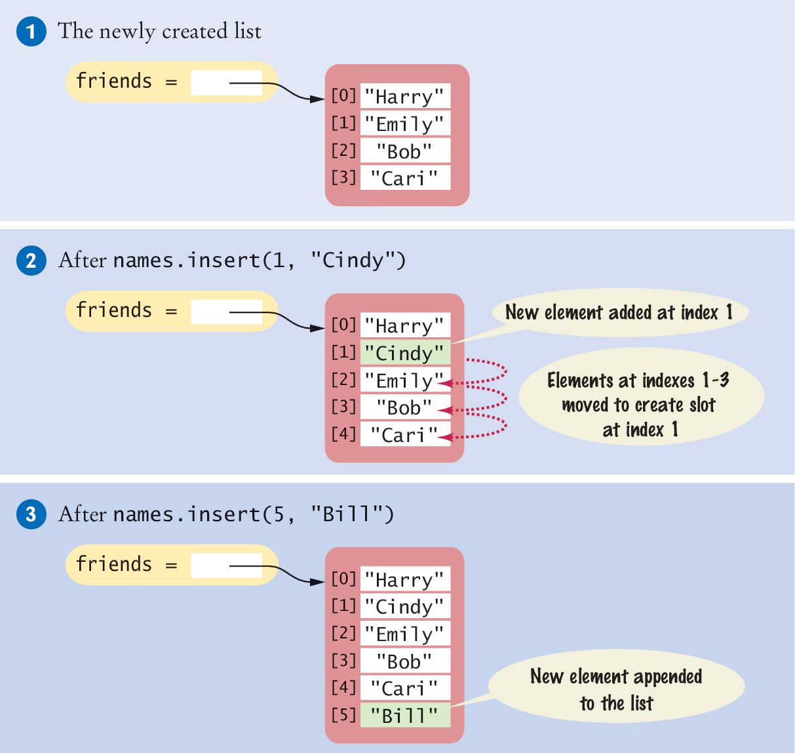

### Finding an Element

- To check **whether** an element is in a list, use the **`in`** operator:

```python
if "Cindy" in friends:
    print("She's a friend")
```

- To get the **position** of the first occurrence, use **`index()`**:

```python
friends = ["Harry", "Emily", "Bob", "Cari", "Emily"]
n = friends.index("Emily")   # n is 1
```

### Removing an Element (by index)

The **`pop(i)`** method removes the element at position `i`. Elements after it shift down, and the list length decreases by 1.

```python
friends = ["Harry", "Cindy", "Emily", "Bob", "Cari", "Bill"]
friends.pop(1)
```

")

### Removing an Element (by value)

Use **`remove(value)`** to remove the **first occurrence** of a value:

```python
my_list = [1, 2, 3, 4, 5]
my_list.remove(3)   # Removes first 3
print(my_list)      # Output: [1, 2, 4, 5]
```

**Note:** `.remove(value)` only removes the first occurrence. If the value is not in the list, Python raises a **`ValueError`**.

### Concatenation

The **`+`** operator concatenates two lists into a new list:

```python
myFriends = ["Fritz", "Cindy"]
yourFriends = ["Lee", "Pat", "Phuong"]
ourFriends = myFriends + yourFriends
# ourFriends is ["Fritz", "Cindy", "Lee", "Pat", "Phuong"]
```

### Replication

The **`*`** operator with an integer creates a new list with repeated copies of the original:

```python
monthInQuarter = [1, 2, 3] * 4
# Result: [1, 2, 3, 1, 2, 3, 1, 2, 3, 1, 2, 3]

monthlyScores = [0] * 12   # Initialize 12 zeros
```

### Equality and Inequality

Use **`==`** and **`!=`** to compare lists by elements and order:

```python
[1, 4, 9] == [1, 4, 9]    # True
[1, 4, 9] == [4, 1, 9]    # False
[1, 4, 9] != [4, 9]       # True
```

### Sum, Maximum, Minimum

- **`sum(sequence)`** returns the sum of numeric elements.
- **`max(sequence)`** and **`min(sequence)`** return the largest and smallest value (numbers or strings).

```python
sum([1, 4, 9, 16])           # 30
max([1, 16, 9, 4])           # 16
min("Fred", "Ann", "Sue")    # "Ann"
```

### Sorting

The **`sort()`** method sorts a list **in place**:

```python
values = [1, 16, 9, 4]
values.sort()   # values is now [1, 4, 9, 16]
```

### Slices of a List

Slicing gives a subset of a list with the syntax **`my_list[start:stop:step]`**:

- **start:** Index where the slice starts (inclusive). Default: start of list.
- **stop:** Index where the slice ends (exclusive). Default: end of list.
- **step:** Interval between indices. Default: 1.

Example: third quarter of monthly data (indices 6, 7, 8):

```python
temperatures = [18, 21, 24, 33, 39, 40, 39, 36, 30, 22, 18]
thirdQuarter = temperatures[6:9]   # Elements 6, 7, 8
```

Omitted indexes mean “from start” or “to end”:

```python
temperatures[:6]    # All elements up to (but not including) index 6
temperatures[6:]    # From index 6 to the end
```

You can also **assign** to a slice:

```python
temperatures[6:9] = [45, 44, 40]
```

### Reference: Common List Functions and Operators

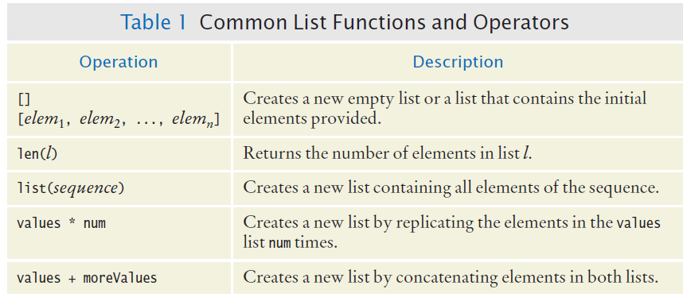
")
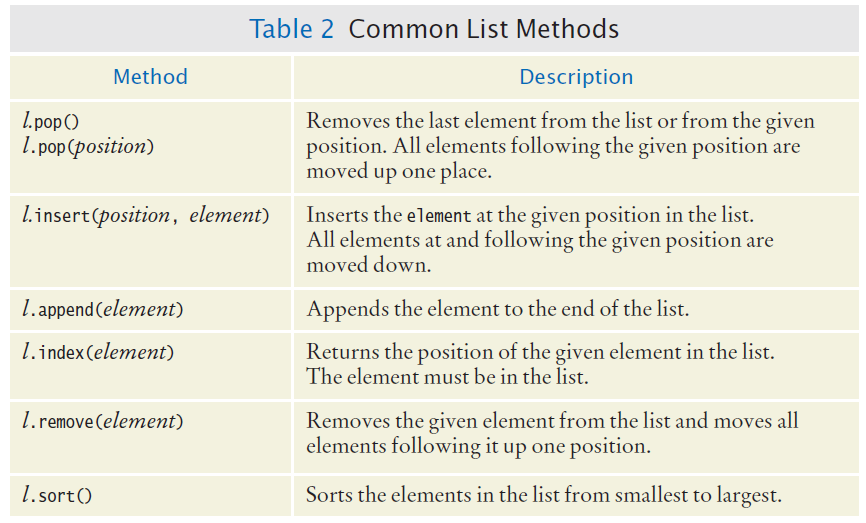

---

## 6.3 Common List Algorithms

### Overview

Typical patterns when working with lists include:

- Filling a list
- Combining elements (sum, concatenate)
- Element separators
- Maximum and minimum
- Linear search
- Collecting and counting matches
- Removing matches
- Swapping elements
- Reading input into a list

### Filling a List

Build a list in a loop, for example squares of 0, 1, 2, …:

```python
values = []
for i in range(n):
    values.append(i * i)
```

### Combining List Elements

**Sum of numbers:**

```python
result = 0.0
for element in values:
    result = result + element
```

**Concatenate strings:**

```python
result = ""
for element in names:
    result = result + element
```

### Element Separators

To display elements separated by commas (e.g., "Harry, Emily, Bob"), add the separator before each element except the first:

```python
for i in range(len(names)):
    if i > 0:
        result = result + ", "
    result = result + names[i]
```

Or print with a separator:

```python
for i in range(len(values)):
    if i > 0:
        print(" | ", end="")
    print(values[i], end="")
print()
```

**Tip:** The built-in **`str.join()`** is often simpler: `", ".join(names)`.

### Maximum and Minimum

Find the largest or smallest value by scanning the list:

```python
largest = values[0]
for i in range(1, len(values)):
    if values[i] > largest:
        largest = values[i]

smallest = values[0]
for i in range(1, len(values)):
    if values[i] < smallest:
        smallest = values[i]
```

### Linear Search

Find the first value greater than a limit. Visit elements until a match or the end of the list:

```python
limit = 100
pos = 0
found = False
while pos < len(values) and not found:
    if values[pos] > limit:
        found = True
    else:
        pos = pos + 1
if found:
    print("Found at position:", pos)
else:
    print("Not found")
```

### Collecting and Counting Matches

**Collect all matches:**

```python
limit = 100
result = []
for element in values:
    if element > limit:
        result.append(element)
```

**Count matches:**

```python
limit = 100
counter = 0
for element in values:
    if element > limit:
        counter = counter + 1
```

### Removing Matches

Remove all elements that meet a condition. Example: remove all strings with length &lt; 4. Use a `while` loop and only advance the index when you do **not** remove an element:

```python
i = 0
while i < len(words):
    word = words[i]
    if len(word) < 4:
        words.pop(i)
    else:
        i = i + 1
```

### Swapping Elements

To swap elements at positions `i` and `j`, use a temporary variable so you do not overwrite a value before copying it:

```python
# Swap values[i] and values[j]
temp = values[i]
values[i] = values[j]
values[j] = temp
```


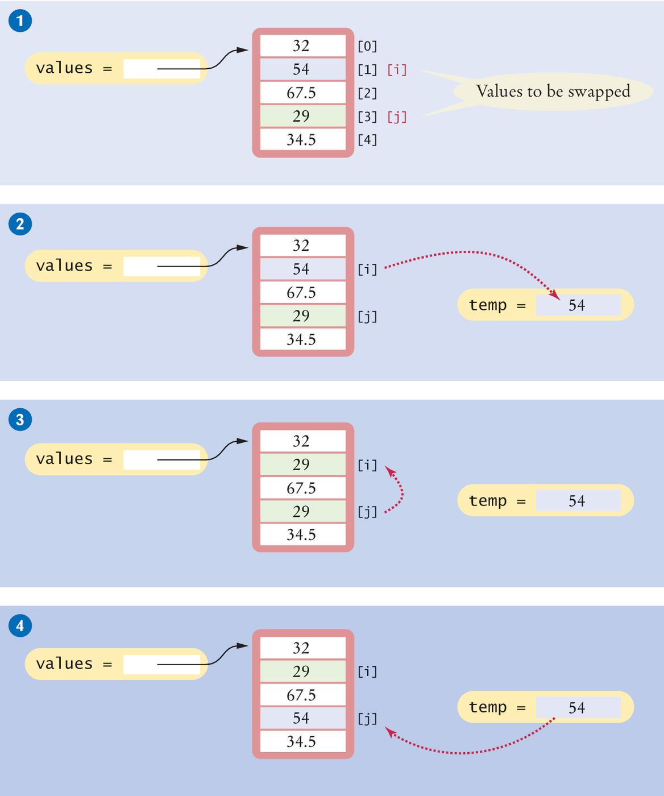

### Reading Input

Read lines of input and store them in a list:

```python
values = []
print("Please enter values, Q to quit:")
userInput = input("")
while userInput.upper() != "Q":
    values.append(float(userInput))
    userInput = input("")
```

---

## 6.4 Using Lists with Functions

### Lists as Arguments

A function can take a list as an argument. Because lists are **mutable**, changes made to the list inside the function are visible to the caller (the function receives a reference to the same list).

Example: a function that does **not** modify the list:

```python
def total(values):
    total_val = 0
    for element in values:
        total_val = total_val + element
    return total_val
```

(We use the name `total_val` to avoid shadowing the built-in **`sum()`** function.)

### Modifying List Elements

A function can modify list elements in place:

```python
def multiply(values, factor):
    for i in range(len(values)):
        values[i] = values[i] * factor
```

When you call `multiply(scores, 10)`, `values` and `scores` refer to the same list, so changes appear in `scores` after the call.

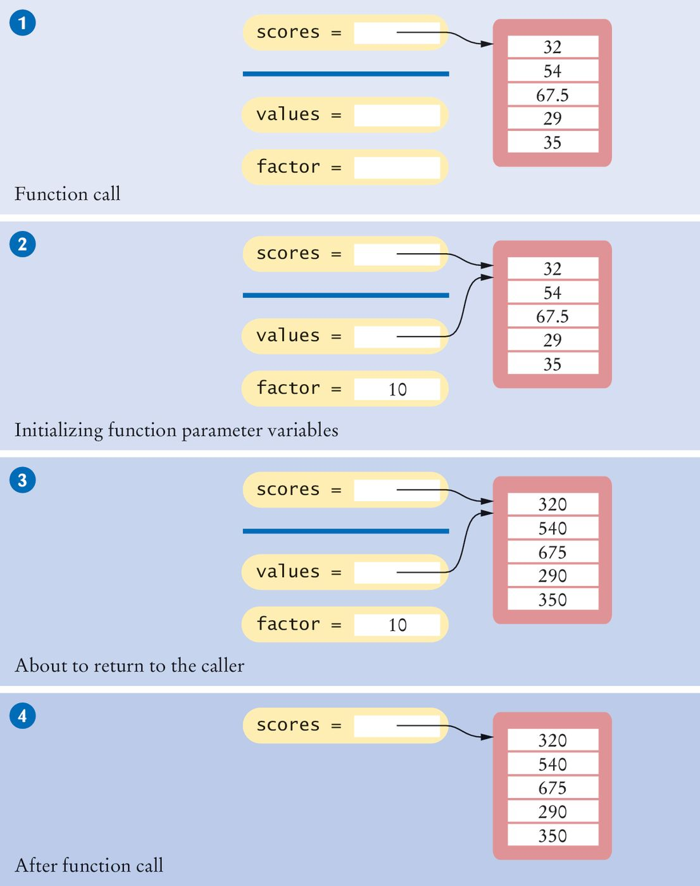

### Returning Lists from Functions

Build a new list in the function and return it. Example: list of squares from 0² to (n−1)²:

```python
def squares(n):
    result = []
    for i in range(n):
        result.append(i * i)
    return result
```

### Parameter Passing in Python

- **Immutable types** (e.g., `int`, `float`, `str`, `tuple`): The function receives a copy of the reference. Changing the parameter does not change the caller’s variable.
- **Mutable types** (e.g., `list`, `dict`, `set`): The function receives a reference to the **same** object. Changes to the object are visible to the caller.

---

## Tuples

A **tuple** is like a list but **immutable**: once created, its contents cannot be changed.

```python
triple = (5, 10, 15)
triple = 5, 10, 15   # Parentheses optional
```

**Why use tuples?**

- **Immutability:** Fixed data that should not be modified.
- **Performance:** Slightly faster and less memory than lists when the collection does not need to change.

### Returning Multiple Values

Tuples are commonly used to return multiple values from a function:

```python
def readDate():
    print("Enter a date:")
    month = int(input("Month: "))
    day = int(input("Day: "))
    year = int(input("Year: "))
    return (month, day, year)

# Call and unpack
date = readDate()
# Or:
month, day, year = readDate()
```

---

## 6.5 Tables

Lists can represent **two-dimensional** data (rows and columns), like a spreadsheet or matrix.

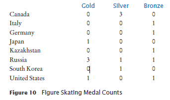

### Creating Tables

A table is a list of lists. Each inner list is one row:

```python
# 8 rows, 3 columns (e.g., medal counts)
counts = [
    [0, 3, 0],
    [0, 0, 1],
    [0, 0, 1],
    [1, 0, 0],
    [0, 0, 1],
    [3, 1, 1],
    [0, 1, 0],
    [1, 0, 1]
]
```

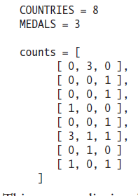
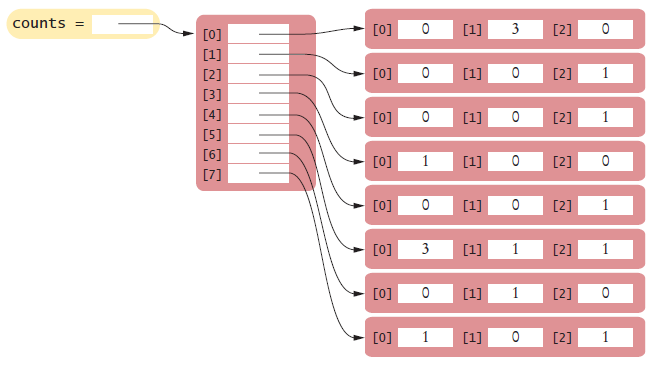

For a large table, build it with a loop:

```python
ROWS = 5
COLUMNS = 20
table = []
for i in range(ROWS):
    row = [0] * COLUMNS
    table.append(row)
```

### Accessing Elements

Use two indices: **row**, then **column** — `table[i][j]`:

```python
medalCount = counts[3][1]

# Print entire table (example with constants COUNTRIES, MEDALS)
for i in range(COUNTRIES):
    for j in range(MEDALS):
        print(f"{counts[i][j]:8d}", end="")
    print()
```

Modern style uses **f-strings** (e.g., `f"{counts[i][j]:8d}"`); the older style `"%8d" % counts[i][j]` still works.

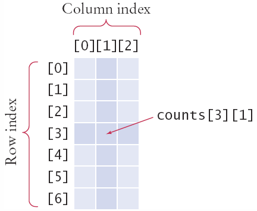

### Locating Neighboring Elements

In 2D data (e.g., grids or games), you often need neighbors of cell `(i, j)`. Check bounds to avoid negative indices or indices past the end of the table.

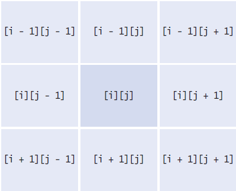

### Adding Rows and Columns

**Sum of a row** (all columns for row `i`):

```python
total = 0
for j in range(MEDALS):
    total = total + counts[i][j]
```

**Sum of a column** (all rows for column `j`):

```python
total = 0
for i in range(COUNTRIES):
    total = total + counts[i][j]
```

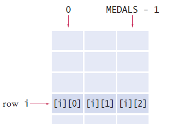
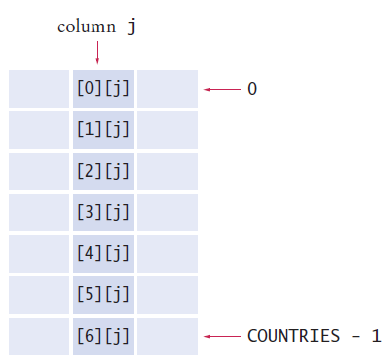

### Using Tables with Functions

When passing a table to a function, use **`len(values)`** for the number of rows and **`len(values[0])`** for the number of columns (assuming rectangular data). Example: sum of all elements:

```python
def table_sum(values):
    total = 0
    for i in range(len(values)):
        for j in range(len(values[0])):
            total = total + values[i][j]
    return total
```

---

## Summary

### Lists

- A list stores a sequence of values. Use **`list[i]`** to access the element at index `i`. Indices start at 0 and must be less than `len(list)`.
- Out-of-range indices cause runtime errors.
- You can iterate by index (`for i in range(len(list))`) or by element (`for x in list`).
- A list variable holds a **reference**. Assigning to another variable gives an alias; use **`list()`** to make a copy.
- Use a temporary variable when swapping two elements.
- Lists can be function parameters and return values. Passing a list passes a reference, so mutations inside the function affect the caller’s list.

### Built-in List Operations

- **`insert(i, x)`** — insert `x` at index `i`
- **`in`** — test whether an element is in the list
- **`pop(i)`** — remove and return element at index `i`
- **`remove(x)`** — remove first occurrence of `x`
- **`+`** — concatenate lists
- **`list(other)`** — copy a list
- **`list[start:stop:step]`** — slice (sublist)

### Tuples

- Create with parentheses or comma-separated values. Tuples are immutable.

### Two-Dimensional Lists

- Use **`table[i][j]`** for row `i`, column `j`.
- Use two indices and bounds checking when working with neighbors or edges.
