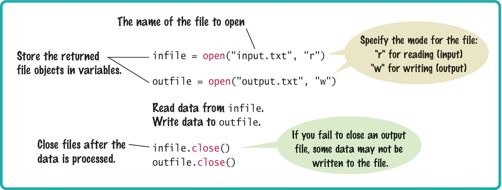
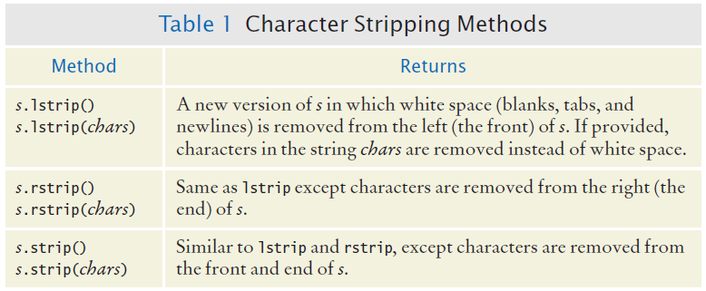
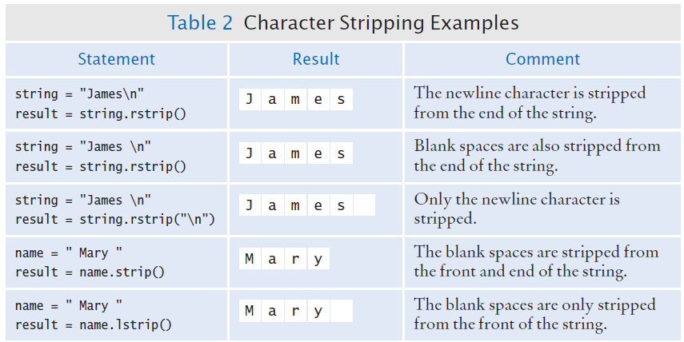
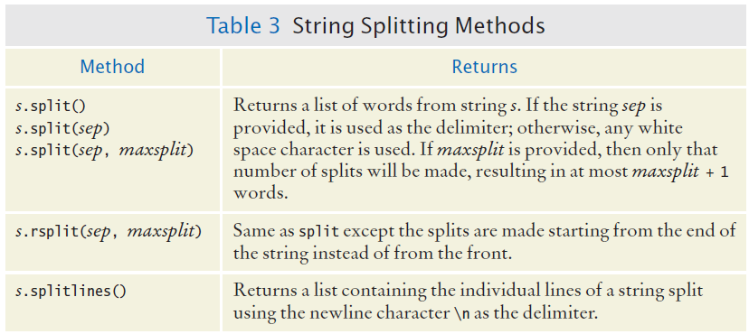
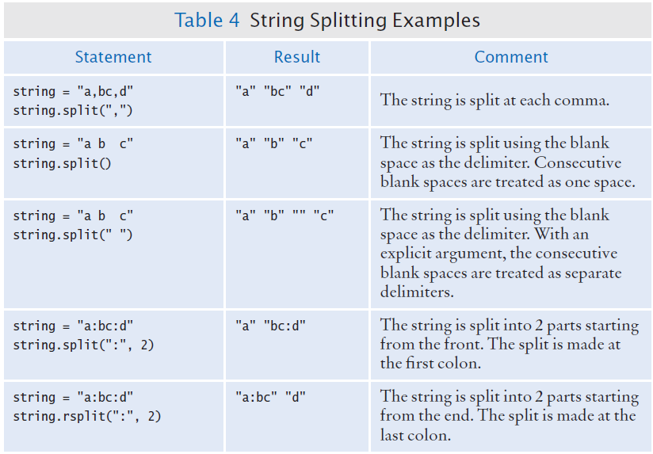
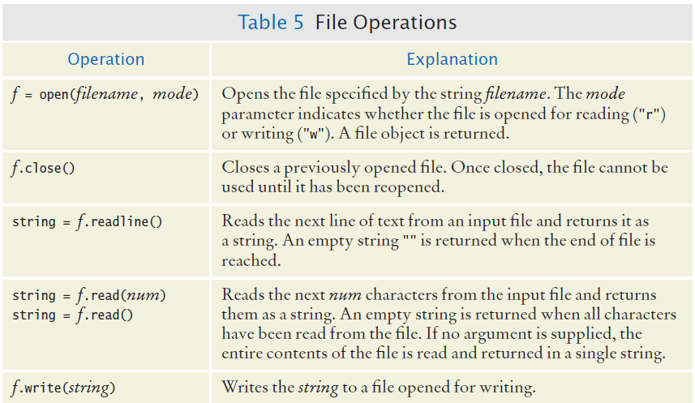
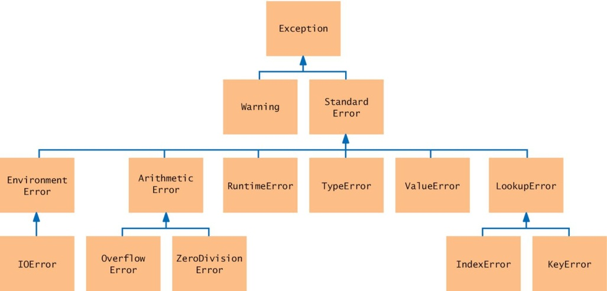
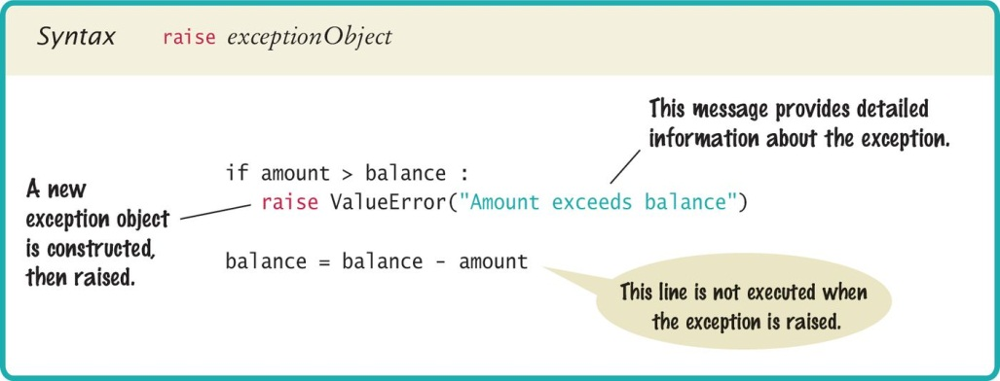
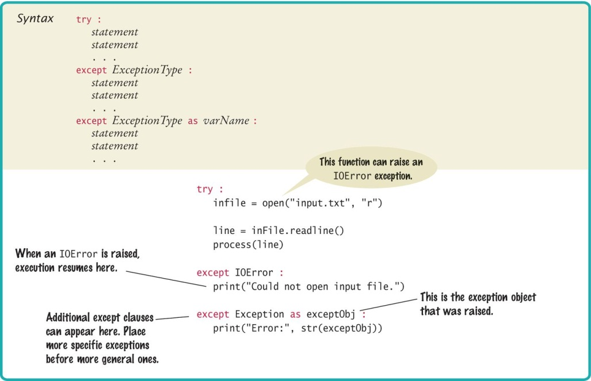

# Chapter 7: Files and Exceptions

---

## Introduction

This chapter shows how to write programs that read and write text files, process file data, use command-line arguments, and raise and handle exceptions. You will learn to work with files safely and to structure programs that deal with real-world data and error conditions.

---

## Chapter Goals

In this chapter you will learn:

- To read and write text files
- To process collections of data from files
- To process command-line arguments
- To raise and handle exceptions

---

[← Back to Course Index](../table-of-contents.md)

## Contents

- Reading and Writing Text Files
- Text Input and Output
- Command-Line Arguments
- Exception Handling

---

## 7.1 Reading and Writing Text Files

### Why Text Files?

Text files are very commonly used to store information. They are among the most portable types of data files. Examples include files created with a simple text editor (e.g., Notepad), as well as Python source code and HTML files.

### Opening Files for Reading

To access a file, you must first **open** it. To read from a file named `input.txt` in the same directory as your program, call `open` with the file name and the mode `"r"`:

```python
infile = open("input.txt", "r")
```

**Important points:**

- When opening a file for reading, the file must exist (and be accessible) or an exception is raised.
- Store the file object returned by `open` in a variable.
- All access to the file is done through that file object.

### Opening Files for Writing (Overwrite)

To open a file for writing, use mode `"w"`:

```python
outfile = open("output.txt", "w")
```

- If the file already exists, it is emptied before new data is written.
- If the file does not exist, a new empty file is created.

### Opening Files for Appending

To add data to the end of an existing file, use mode `"a"`:

```python
outfile = open("output.txt", "a")
```

- If the file already exists, new data is appended at the end.
- If the file does not exist, a new empty file is created.

### Closing Files

When you are done with a file, close it using the **`close()`** method:

```python
infile.close()
outfile.close()
```

If the program exits without closing a file that was opened for writing, some output may not be written to disk.

### Syntax: Opening and Closing Files



### Reading from a File

To read one line of text, use the **`readline()`** method on the file object:

```python
line = infile.readline()
```

When a file is opened, an internal position (sometimes called an input marker) is at the start of the file. `readline()` reads from that position until the end of the line, then advances the position to the next line.

**Example:** If `input.txt` contains:

```
flying
circus
```

- The first call to `readline()` returns `"flying\n"` (the `\n` is the newline character).
- The second call returns `"circus\n"`.
- A third call returns `""` when the end of the file is reached.
- A blank line in the file produces a string containing only `"\n"`.

### Reading Multiple Lines

Read and process lines until you get the sentinel value (empty string) that indicates end of file:

```python
line = infile.readline()
while line != "":
    # Process the line.
    line = infile.readline()
```

### Converting File Input to Numbers

`readline()` returns strings. If the file contains numbers, convert them with `int()` or `float()`:

```python
value = float(line)
```

The newline at the end of the line is ignored when the string is converted to a number.

### Writing to a File

Use the **`write()`** method. Unlike `print()`, you must include the newline character yourself:

```python
outfile.write("Hello, World!\n")
outfile.write(f"Number of entries: {count}\nTotal: {total:8.2f}\n")
```

### Example: File Reading and Writing

**Task:** Read a text file containing one floating-point value per line; write them to a new file in a column, then the total and average.

**Sample input file:**

```
32.0
54.0
67.5
80.25
115.0
```

**Sample output file:**

```
  32.00
  54.00
  67.50
  80.25
 115.00
--------
Total:   348.75
Average:  69.75
```

**Example code:** Open the file `total.py`.

```python
##
#  This program reads a file containing numbers and writes the numbers to
#  another file, lined up in a column and followed by their total and average.
#

# Prompt the user for the name of the input and output files.
inputFileName = input("Input file name: ")
outputFileName = input("Output file name: ")

# Open the input and output files.
infile = open(inputFileName, "r")
outfile = open(outputFileName, "w")

# Read the input and write the output.
total = 0.0
count = 0

line = infile.readline()
while line != "" :
   value = float(line)
   outfile.write(f"{value:15.2f}\n")
   total = total + value
   count = count + 1
   line = infile.readline()

# Output the total and average.
outfile.write(f"{'-'*15}\n")
outfile.write(f"Total:   {total:8.2f}\n")

avg = total / count
outfile.write(f"Average: {average:6.2f}\n")

# Close the files.
infile.close()
outfile.close()
```

### Common Error: Backslashes in File Paths

In a string literal for a Windows path, each backslash must be written twice (because a single backslash starts an escape sequence, e.g. `\n` for newline):

```python
infile = open("c:\\homework\\input.txt", "r")
```

When the user types a path (e.g. from `input()`), they do not double the backslashes.

---

## 7.2 Text Input and Output

### Overview

You will often need to process text by **word**, **line**, or **character**. Python provides methods such as `read()`, `split()`, `strip()`, and `rstrip()` for these tasks.

### Iterating Over Lines

You can treat an open file as a sequence of lines. This loop reads and prints every line:

```python
for line in infile:
    print(line)
```

Each time through the loop, `line` is the next line (including the newline). A file is not like a list: once you have read through it, you must close and reopen it to iterate again.

### Reading Words Example

You can read by line and then split into words. Example input and output:

- **Input:** `Mary had a little lamb`
- **Output:** one word per line: `Mary`, `had`, `a`, `little`, `lamb`

```python
for line in inputFile:
    line = line.rstrip()
    # ... process words in line
```

### Removing the Newline

Each line read from a file usually ends with `\n`. Remove it with **`rstrip()`**:

```python
line = line.rstrip()
```

")

")

### Character Strip Methods



### Character Strip Examples



### Reading Words

To process a file word by word, read each line, strip the newline, then **split** the line into words:

```python
line = line.rstrip()
wordlist = line.split()
```

`split()` returns a list of substrings separated by whitespace. If the last word has punctuation (e.g. `lamb,`), strip it with:

```python
word = word.rstrip(".,?!")
```

")

")

### Reading Words: Complete Example

Suppose **lyrics.txt** contains:

```text
Mary had a little lamb,
whose fleece was white as snow.
```

Then the following code reads it word by word:

```python
inputFile = open("lyrics.txt", "r")
for line in inputFile:
    line = line.rstrip()
    wordList = line.split()
    for word in wordList:
        word = word.rstrip(".,?!")
        print(word)
inputFile.close()
```


### Additional String Splitting Methods



### Additional String Splitting Examples



### Reading Characters

The **`read(n)`** method reads up to `n` characters and returns a string. With `n = 1` you read one character:

```python
char = inputFile.read(1)
```

At end of file, `read()` returns `""`.

**Pattern for reading character by character:**

```python
char = inputFile.read(1)
while char != "":
    # Process character
    char = inputFile.read(1)
```

### Reading Records

A text file can store **records**, each with several **fields** (e.g. ID, name, address, year). In general you read a full record before processing it:

- For each record: read the entire record, then process it.

**Record format 1 — one field per line:**  
Each field on its own line, all fields of one record on consecutive lines:

```
China
1330044605
India
1147995898
United States
303824646
```

Read two lines per record:

```python
line = infile.readline()
while line != "":
    countryName = line.rstrip()
    line = infile.readline()
    population = int(line)
    # Process data record
    line = infile.readline()
```

**Record format 2 — one record per line with delimiter:**  
Fields separated by a delimiter (e.g. `:`):

```
China:1330044605
India:1147995898
United States:303824646
```

Use `split()` on the delimiter to get the fields.

**Record format 3 — one line, no delimiter:**  
e.g. `China 1330044605`, `United States 303824646`. You cannot split on spaces because country names can have multiple words. Use **`rsplit(" ", 1)`** to split only on the last space:

```python
inputString = "United States 303824646"
result = inputString.rsplit(" ", 1)
print(result)   # ['United States', '303824646']
```

Alternatively, find the first digit and slice the line:

```python
i = 0
while i < len(line) and not line[i].isdigit():
    i = i + 1
countryName = line[:i].rstrip()
population = int(line[i:])
```


### File Operations Summary



---

## 7.3 Command-Line Arguments

### Running Programs

Programs can be run from an IDE (e.g. Wing) or from a terminal. When run from the terminal, you can pass **command-line arguments** after the program name. These are given to the program as strings.

### Using Command-Line Arguments

Text-based programs can be **parameterized** with command-line arguments. A typical invocation:

```text
python program.py -v input.dat
```

- `argv[0]`: `"program.py"`
- `argv[1]`: `"-v"`
- `argv[2]`: `"input.dat"`

Options (switches) often start with a dash. Python exposes the arguments in the **`sys.argv`** list:

```python
import sys

print("This is the name of the program:", sys.argv[0])
print("Argument list:", str(sys.argv))
```

### When to Use Command-Line Arguments

In this course we often use an interactive interface. Command-line arguments are especially useful when you need to **automate** a program (e.g. from scripts or other tools).

---

## 7.4 Exception Handling

### Two Aspects of Errors

- **Detecting errors:** e.g. `open()` can detect that a file does not exist.
- **Handling errors:** The function that detects the error usually does not know how to fix it, so it **raises an exception** and lets another part of the program handle it. Exception handling passes control from the point of the error to a **handler** that can respond appropriately.

### Raising Exceptions

When a condition is wrong (e.g. withdrawal amount exceeds balance), you can **raise** an exception. Execution then jumps to an exception handler instead of continuing with the next statement:

```python
if amount > balance:
    raise ValueError("Amount exceeds balance")
```

### Exception Classes (Subset)

Common built-in exceptions include `ValueError`, `TypeError`, `RuntimeError`, `OSError`, `FileNotFoundError`, and others. Choose (or define) an exception that fits the error.



### Syntax: Raising an Exception



### Handling Exceptions

Every exception should be handled somewhere. You can:

- Handle each possible exception type and react appropriately.
- For recoverable errors: exit the program, or ask the user to correct the input.

### try/except

Put code that might raise an exception in a **`try`** block, and the handler in an **`except`** clause:

```python
try:
    filename = input("Enter filename: ")
    infile = open(filename, "r")
    line = infile.readline()
    value = int(line)
    # ...
except OSError:
    print("Error: file not found or could not be opened.")
except ValueError as exception:
    print("Error:", str(exception))
```

- If the file cannot be opened, an `OSError` (or `FileNotFoundError`) is raised and the first `except` runs.
- If `int(line)` fails, a `ValueError` is raised and the second `except` runs.
- If any exception is raised in the `try` block, the rest of the `try` block is skipped.

**Note:** In Python 3, `open()` for a missing file raises `FileNotFoundError` (a subclass of `OSError`). Catching `OSError` will also catch `FileNotFoundError`.

### Getting the Exception Message

Store the exception in a variable with **`as`** to print or use its message:

```python
except ValueError as exception:
    print("Error:", str(exception))
```

For `int("35x2")`, the message might be: `invalid literal for int() with base 10: '35x2'`.

### Custom Messages When Raising

When you raise an exception, you can pass a message:

```python
raise ValueError("Amount exceeds balance")
```

That string is the message associated with the exception object.

### The finally Clause

Use **`finally`** when you must run cleanup (e.g. closing a file) whether or not an exception occurred:

```python
outfile = open(filename, "w")
try:
    writeData(outfile)
finally:
    outfile.close()
```



### Programming Tips

**Raise early.** If a function detects a problem it cannot fix, raise an exception rather than applying a bad fix.

**Catch late.** Only catch an exception where you can actually handle it. Otherwise, let it propagate to a caller that can.

**Avoid mixing `except` and `finally` in one `try`.** The `finally` block runs when the `try` is exited: by finishing normally, by an `except` handling an exception, or by an unhandled exception. If the file object might be `None` (e.g. `open` failed), calling `close()` in `finally` could raise another exception. Prefer nested `try` blocks:

```python
try:
    outfile = open(filename, "w")
    try:
        # Write output to outfile
    finally:
        outfile.close()
except OSError:
    # Handle exception
```

### The with Statement

Python’s **`with`** statement opens a file and guarantees it is closed when the block is left (normally or by exception):

```python
with open(filename, "w") as outfile:
    # Write output to outfile
# outfile is closed here
```

---

## Summary

### File Input/Output

- Open a file with `open(filename, mode)` where mode is `"r"`, `"w"`, or `"a"`.
- Close files when done with `close()`, or use `with open(...) as f:`.
- Use `readline()` to read one line; use a loop or iterate with `for line in file` to read all lines.
- Write with `write()` (remember to add `\n` for new lines) or with `print(..., file=f)`.

### Processing Text Files

- Iterate over a file to read line by line.
- Use `rstrip()` to remove the newline (and optionally other characters).
- Use `split()` or `rsplit()` to break a line into words or fields.
- Use `read(n)` to read a fixed number of characters.

### Command-Line Arguments

- Use `sys.argv` to get the list of command-line arguments (including the script name in `argv[0]`).

### Exceptions

- Use **`raise`** to signal an error; execution continues in a matching **`except`** block.
- Put risky code in a **`try`** block and handlers in **`except`** clauses.
- Use **`finally`** for cleanup that must run whether or not an exception occurred.
- Raise as soon as you detect a problem; catch only where you can handle it. For each possible exception, decide which part of the program should handle it.
