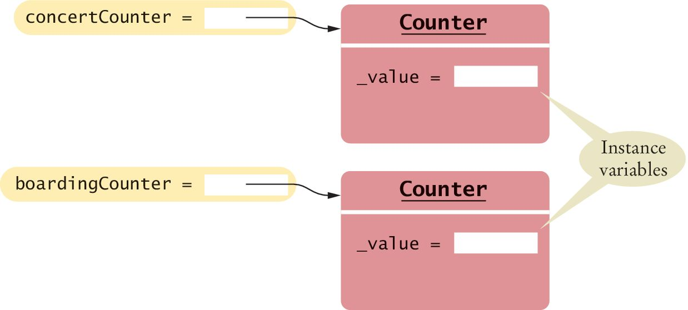
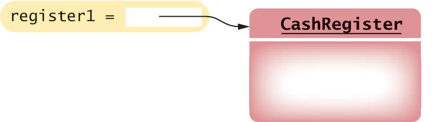
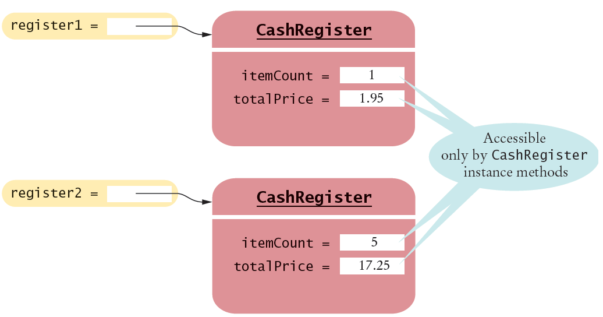
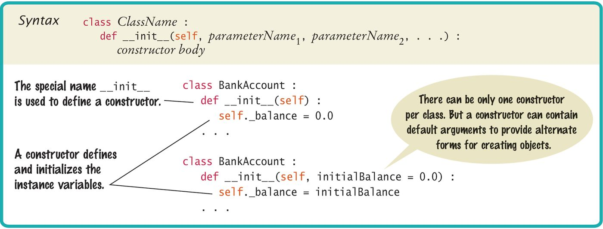
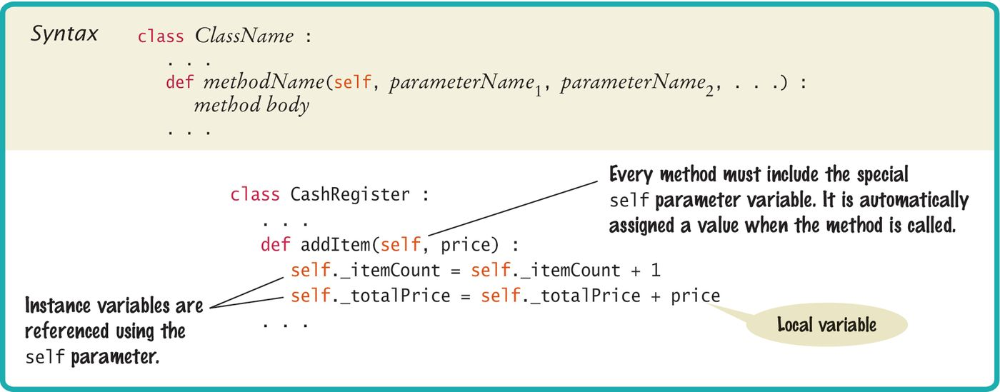
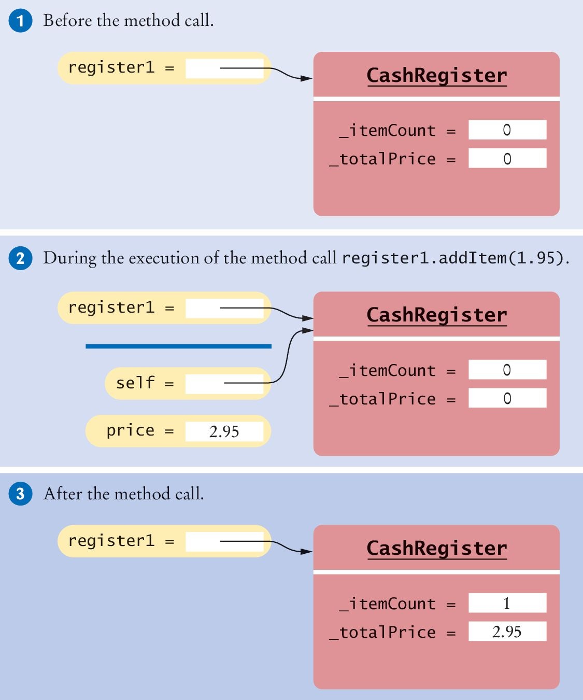

# Chapter 9: Objects and Classes

---

## Introduction

In this chapter you will learn how to discover, specify, and implement your own Python classes and how to use them in your programs. Topics include encapsulation, instance variables, methods, constructors, and object references.

---

## Chapter Goals

In this chapter you will learn:

- To understand the concepts of classes, objects, and encapsulation
- To implement instance variables, methods, and constructors
- To design, implement, and test your own classes
- To understand the behavior of object references

---

[← Back to Course Index](../table-of-contents.md)

## Contents

- Object-oriented programming (9.1)
- Implementing a simple class (9.2)
- The public interface and data representation (9.3)
- Constructors (9.4)
- Implementing methods and class variables (9.5)
- Object references (9.6)
- Chapter summary (9.7)

---

## 9.1 Object-Oriented Programming

So far you have used **structured programming**: breaking work into subtasks and writing reusable functions (and methods in the procedural sense) to handle them. To build larger programs and to model things in the real world more naturally, we use **objects** and **classes**.

A **class** is a blueprint for objects that share the same behavior. An **object** (an **instance** of a class) is one concrete entity created from that blueprint. For example, a `Car` class describes passenger vehicles with a given capacity and shape; each actual car you model is an object of that class.

### From functions to collaborating objects

You already structure programs with functions. For very large systems, a flat web of functions alone becomes hard to understand and change. **Object-oriented programming** is a style in which programs are built from **objects** that cooperate: each object owns some **data** and exposes **methods** that operate on that data.

### Objects you already use

You have already used this idea. Values such as strings, lists, and open files are **objects**. Each kind of object supports particular methods—for example, you can call `insert()` or `remove()` on a list.

### Classes in Python: `str` and `list`

In Python, the **`str`** class describes the behavior of all string objects: how characters are stored (in implementation terms), which operations are allowed, and how those operations work. When you have a `str` value, you can call string methods such as `upper()`.

The **`list`** class describes a different kind of object: an ordered collection. It comes with a different set of methods. The method `upper()` exists on strings, not on lists—so the first call below is illegal. The method `pop()` is part of the list interface, so the second call is legal:

```python
["Hello", "World"].upper()  # Error: list has no .upper()
["Hello", "World"].pop()    # OK: removes and returns last element
```

### Public interface

The **public interface** of a class is the set of methods (and their documented behavior) that you are expected to use. When you use an object, you do not need to know _how_ it stores its data internally or _how_ a method is coded—only **which** methods exist and **what** they do. You do not need the internal details of a `str` or a `list` to use them well; you need their public interface.

### Encapsulation

**Encapsulation** means designing a clear public interface while **hiding** implementation details inside the class. On long-lived projects, those details often change (for speed, features, or correctness). If callers rely only on the interface, improvements inside the class do not break code that uses the object correctly.

---

## 9.2 Implementing a Simple Class

Example:  
Tally Counter: A class that models a mechanical device that is used to count people
For example, to find out how many people attend a concert or board a bus
What should it do?

- Increment the tally
- Get the current total

### Using the Counter Class

First, we construct an object of the class (object construction will be covered shortly):
In Python, you don’t explicitly declare instance variables
Instead, when one first assigns a value to an instance variable, the instance variable is created

```python
tally = Counter()   # Creates an instance
```

Next, we invoke methods on our object

```python
tally.reset()
tally.click()
tally.click()
result = tally.getValue()  # Result is 2
tally.click()
result = tally.getValue() # Result is 3
```

### Instance Variables

An object stores its data in instance variables
An instance of a class is an object of the class
In our example, each Counter object has a single instance variable named \_value
For example, if concertCounter and boardingCounter are two objects of the Counter class, then each object has its own \_value variable



Instance variables are part of the implementation details that should be hidden from the user of the class
With some programming languages an instance variable can only be accessed by the methods of its own class
The Python language does not enforce this restriction
However, the underscore indicates to class users that they should not directly access the instance variables

### Class Methods

The methods provided by the class are defined in the class body
The click() method advances the \_value instance variable by 1

```python
def click(self) :
    self._value = self._value + 1
```

A method definition is very similar to a function with these exceptions:
A method is defined as part of a class definition
The first parameter variable of a method is called self

### Class Methods and Attributes

Note how the click() method increments the instance variable \_value
Which instance variable? The one belonging to the object on which the method is invoked
In the example below the call to click() advances the \_value variable of the concertCounter object
No argument was provided when the click() method was called even though the definition includes the self parameter variable
The self parameter variable refers to the object on which the method was invoked concertCounter in this example

```python
concertCounter.click()
```

### Example of Encapsulation

The `getValue()` method returns the current `_value`:

```python
def getValue(self) :
    return self._value
```

This method is provided so that users of the Counter class can find out how many times a particular counter has been clicked
A class user should not directly access any instance variables
Restricting access to instance variables is an essential part of encapsulation

### Complete Simple Class Example

```python
## Models a tally counter whose value can be incremented, viewed, or reset.
class Counter :
   ## Gets the current value of this counter.
   #  @return the current value
   #
   def getValue(self) :
      return self._value

   ## Advances the value of this counter by 1.
   #
   def click(self) :
      self._value = self._value + 1

   ## Resets the value of this counter to 0.
   #
   def reset(self) :
      self._value = 0


tally = Counter()
tally.reset()
tally.click()
tally.click()

result = tally.getValue()
print("Value:", result)

tally.click()
result = tally.getValue()
print("Value:", result)
```

---

## 9.3 The public interface and data representation

When you design a class, start by specifying the public interface of the new class
What tasks will this class perform?
What methods will you need?
What parameters will the methods need to receive?

### Example Public Interface

Since the ‘self’ parameter is required for all methods it was excluded for simplicity

| Task                                   | Method         |
| -------------------------------------- | -------------- |
| Add the price of an item               | addItem(price) |
| Get the total amount owed              | getTotal()     |
| Get the count of items purchased       | getCount()     |
| Clear the cash register for a new sale | clear()        |

Example: A Cash Register Class

### Writing the Public Interface

Below is a **sketch** of the `CashRegister` public interface (method bodies omitted):

```python
# A simulated cash register that tracks the item count and the total amount due.
class CashRegister:
    # Adds an item to this cash register.
    # @param price the price of this item
    def addItem(self, price):
        ...
    # Gets the total price of all items in the current sale.
    # @return the total price
    def getTotal(self):
        ...
```

The method declarations make up the public interface of the class
The data and method bodies make up the private implementation of the class
Class comments document the class and the behavior of each method

### Using the Class

After defining the class we can now construct an object:

```python
register1 = CashRegister()  # constructs a CashRegister object
```



This statement defines the register1 variable and initializes it with a reference to a new CashRegister object

### Using Methods

Now that an object has been constructed, we are ready to invoke a method:

```python
register1.addItem(1.95) # Invokes a method.
```

### Accessor and Mutator Methods

Many methods fall into two categories:

1.  Accessor Methods : ' get ' methods

Asks the object for information without changing it
Normally returns the current value of an attribute

```python
def getTotal(self):
def getCount(self):
```

2.  Mutator Methods : ' set ' methods

Changes values in the object
Usually take a parameter that will change an instance variable

```python
def addItem(self, price):
def clear(self):
```

### Instance Variables of Objects

Each object of a class has a separate set of instance variables



The values stored in instance variables make up the state of the object.

### Designing the Data Representation

Decide **what each object must remember** so its methods can do their work. That remembered state is stored in **instance variables**—values that belong to one object and that every method on that object can read or update.

**CashRegister:** For each thing the class must do, list which pieces of state the corresponding method needs. If two methods need the same piece of state, use **one** instance variable for it (for example, both `addItem` and `clear` affect the running total and item count).

| What the user wants | Method           | Instance variables this method uses                   |
| ------------------- | ---------------- | ----------------------------------------------------- |
| Add an item's price | `addItem(price)` | `total` (add `price` to it), `count` (increment by 1) |
| See the total owed  | `getTotal()`     | `total`                                               |
| See how many items  | `getCount()`     | `count`                                               |
| Start a new sale    | `clear()`        | `total` and `count` (reset both)                      |

So this class needs at least **`total`** and **`count`** as instance variables; methods cooperate by reading and updating those same two variables.

### Programming Tip 9.1

All instance variables should be private and most methods should be public
Although most object-oriented languages provide a mechanism to explicitly hide or protect private members from outside access, Python does not
It is common practice among Python programmers to use names that begin with a single underscore for private instance variables and methods
The single underscore serves as a flag to the class user that those members are private

You should always use encapsulation, in which all instance variables are private and are only manipulated with methods
Typically, methods are public
However, sometimes you have a method that is used only as a helper method by other methods
In that case, you should identify the helper method as private by using a name that begins with a single underscore

### Steps to implement a class

1. List what your objects should be responsible for (including easy-to-miss duties—for example, reporting an account balance).
2. Specify and document the **public interface**.
3. Decide which **instance variables** are needed to support that interface.
4. Implement **constructors** and **methods**.
5. **Test** the class on its own before you plug it into a large program.

---

## 9.4 Constructors

A constructor is a method that initializes instance variables of an object
It is automatically called when an object is created

```python
def __init__(self) :
    self._itemCount = 0
    self._totalPrice = 0
```

Calling the class like a function—for example, `CashRegister()`—is what constructs an object and runs the constructor (`__init__`).

```python
register = CashRegister()
```

Python uses the special name `__init__` for the constructor because its purpose is to initialize an instance of the class:

### Default and Named Arguments

Only one constructor can be defined per class
But you can define a constructor with **default argument values** that simulate multiple definitions

```python
class BankAccount :
    def __init__(self, initialBalance = 0.0) :
        self._balance = initialBalance
joesAccount = BankAccount()   # Balance is set to 0
```

If no value is passed to the constructor when a BankAccount object is created the default value will be used

### Default and Named Arguments

If a value is passed to the constructor that value will be used instead of the default one

```python
joesAccount = BankAccount(499.95)  # balance is set to 499.95
```

Default arguments can be used in any method and not just constructors

### Syntax: Constructors



### Constructors: Self

The first parameter variable of every constructor must be self
When the constructor is invoked to construct a new object, the self parameter variable is set to the object that is being initialized

```python
def __init__(self) :
    self._itemCount = 0
    self._totalPrice = 0
```

Refers to the object being initialized

```python
register = CashRegister()
```

After the constructor ends this is a reference to the newly created object

### Object References

This reference then allows methods of the object to be invoked

```python
register = CashRegister()
```

After the constructor ends this is a reference to the newly created object

```python
print("Your total $", register.getTotal())
```

Call the method through the reference

### Common Error 9.1

After an object has been constructed, you should not directly call the constructor on that object again:

```python
register1 = CashRegister()
register1.__init__()   # Bad style
```

The constructor can prepare a new **CashRegister** in a cleared state, but you should not call the constructor on an existing object. Instead, replace the object with a new one:
In general, you should never call a Python method that starts with a double underscore. **They** are intended for specific internal purposes (in this case, to initialize a newly created object).

```python
register1 = CashRegister()
register1 = CashRegister()   # OK
```

---

## 9.5 Implementing Methods

Implementing a method is very similar to implementing a function except that you access the instance variables of the object in the method body

| Task                                   | Method         |
| -------------------------------------- | -------------- |
| Add the price of an item               | addItem(price) |
| Get the total amount owed              | getTotal()     |
| Get the count of items purchased       | getCount()     |
| Clear the cash register for a new sale | clear()        |

```python
def addItem(self,  price ):
   self._itemCount  = self._itemCount  + 1
   self._totalPrice  = self._totalPrice  +  price
```

### Syntax: Instance Methods

Use instance variables inside methods of the class
Similar to the constructor, all other instance methods must include the self parameter as the first parameter
You must specify the self implicit parameter when using instance variables inside the class



### Invoking Instance Methods

As with the constructor, every method must include the special self parameter variable, and it must be listed first.
When a method is called, a reference to the object on which the method was invoked ( register1 ) is automatically passed to the self parameter variable:

### Accessing Instance Variables

To access an instance variable, such as \_itemCount or \_totalPrice , in a method, you must access the variable name through the self reference
This indicates that you want to access the instance variables of the object on which the method is invoked, and not those of some other CashRegister object
The first statement in the addItem() method is

```python
self._itemCount = self._itemCount + 1
```

Which _ itemCount is incremented?
In this call, it is the _ itemCount of the register1 object.



### Calling One Method Within Another

When one method needs to call another method on the same object , you invoke the method on the self parameter

```python
def addItems(self, quantity, price) :
    for i in range(quantity) :
         self.addItem(price)
```

### Example: CashRegister.py

```python
##
#  This module defines the CashRegister class.
#

## A simulated cash register that tracks the item count and the total amount due.
#
class CashRegister :
   ## Constructs a cash register with cleared item count and total.
   #
   def __init__(self) :
      self._itemCount = 0
      self._totalPrice = 0.0

   ## Adds an item to this cash register.
   #  @param price the price of this item
   #
   def addItem(self, price) :
      self._itemCount = self._itemCount + 1
      self._totalPrice = self._totalPrice + price

   ## Gets the price of all items in the current sale.
   #  @return the total price
   #
   def getTotal(self) :
      return self._totalPrice

   ## Gets the number of items in the current sale.
   #  @return the item count
   #
   def getCount(self) :
      return self._itemCount

   ## Clears the item count and the total.
   #
   def clear(self) :
      self._itemCount = 0
      self._totalPrice = 0.0
```

### Class Variables

A class variable is a value that belongs to the **class**, not to any one instance
Class variables are often called “static variables”
Class variables are declared at the same level as methods
In contrast, instance variables are created in the constructor

### Class Variables : Example

We want to assign bank account numbers sequentially: the first account is assigned number 1001, the next with number 1002, and so on
To solve this problem, we need to have a single value of \_ lastAssignedNumber that is a property of the class , not any object of the class

```python
class BankAccount :
     _lastAssignedNumber = 1000  # A class variable
    def __init__(self) :
        self._balance = 0
        BankAccount._lastAssignedNumber = BankAccount._lastAssignedNumber + 1
        self._accountNumber = BankAccount._lastAssignedNumber
```

Every `BankAccount` object has its own `_balance` and `_accountNumber` instance variables, but there is only a single copy of the `_lastAssignedNumber` variable
That variable is stored in a separate location, outside any `BankAccount` object
Like instance variables, class variables should always be private to ensure that methods of other classes do not change their values. However, class constants can be public

For example, the BankAccount class can define a public constant value, such as

```python
class BankAccount:
    OVERDRAFT_FEE = 29.95
    # ...
```

Methods from any class can refer to such a constant as BankAccount.OVERDRAFT_FEE

---

## 9.6 Object references

### Names and objects

In Python, a **variable name does not embed the whole object** inside the name. The name refers to an **object** stored elsewhere; what the variable holds is best thought of as a **reference** (a link to that object). When you call a constructor such as `CashRegister()`, Python creates a new object, runs `__init__`, and the expression `CashRegister()` **evaluates to a reference** to that new object. Assigning that result to `reg1` stores that reference in `reg1`:

```python
reg1 = CashRegister()  # reg1 refers to one CashRegister object
```

You then **call methods through the reference**: `reg1.addItem(1.95)` finds the object `reg1` refers to and runs `addItem` on it.

### Assignment copies the reference

An assignment such as `reg2 = reg1` **does not copy the cash register**. It copies the **reference**, so both names refer to the **same** object. That situation—two variables naming one object—is often called an **alias**.

```python
reg1 = CashRegister()
reg2 = reg1          # reg2 is an alias for the same object as reg1
reg1.addItem(2.50)
print(reg2.getTotal())   # Same object: total includes that item
```

If you want **two separate** registers, you need **two** construction calls:

```python
reg1 = CashRegister()
reg2 = CashRegister()    # second, independent object
```

### Identity: `is` and `is not`

To test whether two variables refer to **the exact same object** (same identity), use **`is`** or **`is not`**:

```python
if reg1 is reg2:
    print("Both names refer to one object.")
```

This is different from **`==`**, which asks whether the values are **equal** according to the rules of that type. For many built-in types, `==` compares contents; for objects, equality depends on how the class defines it (often not covered in your first custom classes). When you care only whether two variables are aliases, use **`is`**.

### `None`

**`None`** is a special value that means **“no object”**. It is often used to mean “not set yet” or “optional value absent.” A variable can refer to **`None`** instead of to an instance:

```python
currentSale = None     # no register object yet
currentSale = CashRegister()
```

Functions and methods that have nothing useful to return sometimes **`return None`** explicitly (or fall off the end without returning a value, which also yields `None`).

---

## 9.7 Chapter summary

- A **class** describes behavior shared by its **objects**; you work through the class’s **public interface** (its methods).
- **Encapsulation**: expose a clear interface, hide implementation details so they can change without breaking callers.
- **Instance variables** hold per-object state; **class variables** are shared by all instances of the class.
- **Private-by-convention** (`_name`): Python does not block access—callers should still use the interface.
- **Mutators** change object state; **accessors** report state without (or with minimal) change.
- Pick a **data representation** that supports every accessor and tolerates methods called in any reasonable order.
- **`__init__`** initializes a new instance; **default arguments** allow multiple construction styles.
- The receiver is passed as **`self`**; use `self` inside methods to read or update instance variables.
- Variables hold **object references**, not the objects themselves. Assignment copies the reference; two names can **alias** the same object. Use **`is`** / **`is not`** to test **identity** (same object). **`None`** means “no object.”
